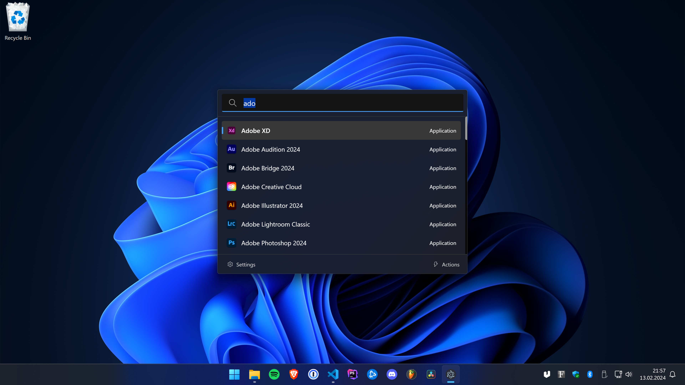

# Ueli

Ueli is a cross-platform keystroke launcher.

# Installation

## Windows

-   Recommended: Get the app from the [Microsoft Store](https://www.microsoft.com/store/productId/9PK44N42B2G7?ocid=pdpshare) or install it with winget: `winget install Ueli -s msstore`.
-   Optionally, you can also manually download and install the app from [here](https://github.com/oliverschwendener/ueli/releases/latest), but note that, due to cost reasons, these binaries are not signed.

## macOS

-   Download and install the app from [here](https://github.com/oliverschwendener/ueli/releases/latest). Note that, due to cost reasons, these binaries are neither signed nor notarized.

## Linux

-   Download and install the app from [here](https://github.com/oliverschwendener/ueli/releases/latest).

# Development

Check out the [wiki](https://github.com/oliverschwendener/ueli/wiki/Development).
