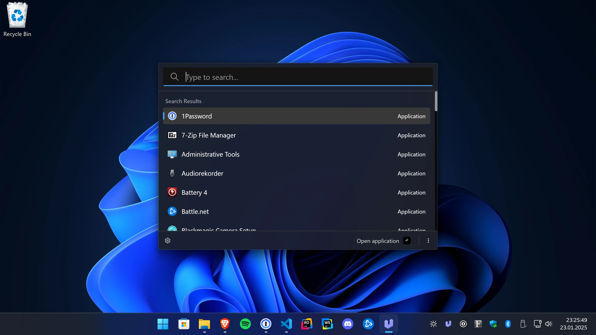

# Ueli

Ueli is a cross-platform keystroke launcher.

# Installation

**Please download Ueli only from the Microsoft Store, the Website https://ueli.app, or this repository.**

## Windows

Get the app from the [Microsoft Store](https://www.microsoft.com/store/productId/9PK44N42B2G7?ocid=pdpshare) or install it with winget: `winget install Ueli -s msstore`.

Optionally, you can also manually download and install the app from [here](https://github.com/oliverschwendener/ueli/releases/latest), but note that, due to cost reasons, these binaries are not signed. Windows will prevent you from installing / opening the app.

## macOS

Download and install the app from [here](https://github.com/oliverschwendener/ueli/releases/latest). Note that, due to cost reasons, these binaries are neither signed nor notarized.

> Because Ueli is neither signed nor notarized, macOS will prevent you from installing or opening the app. When you try to launch the app for the first time macOS will block it from opening. You can open the "System Settings", go to "Privacy & Security" and click on "Open anyway", see screenshot.

## Linux

Download and install the app from [here](https://github.com/oliverschwendener/ueli/releases/latest).

# Wiki

For more documentation check out the [wiki](https://github.com/oliverschwendener/ueli/wiki).
