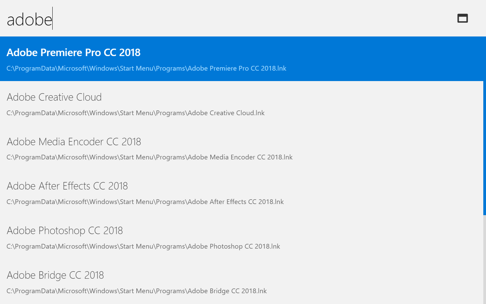
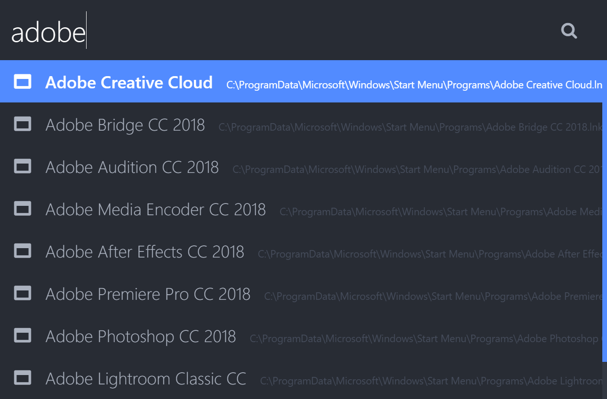
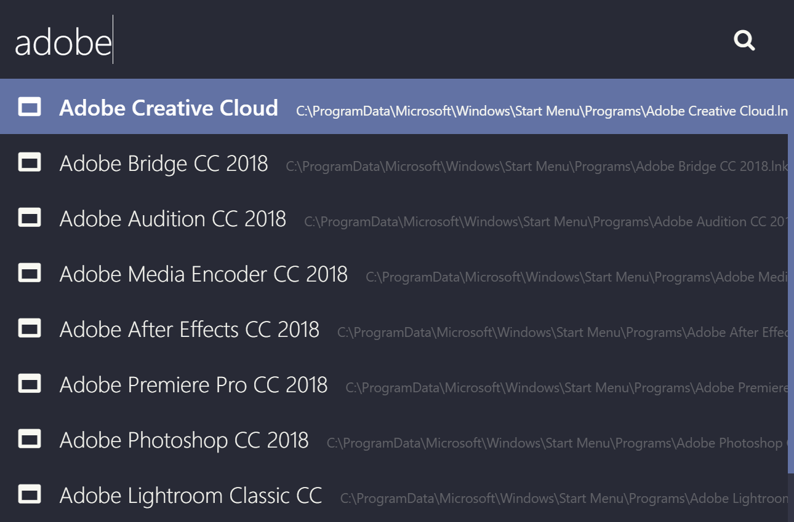
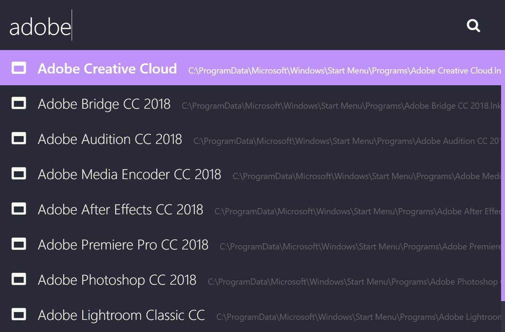
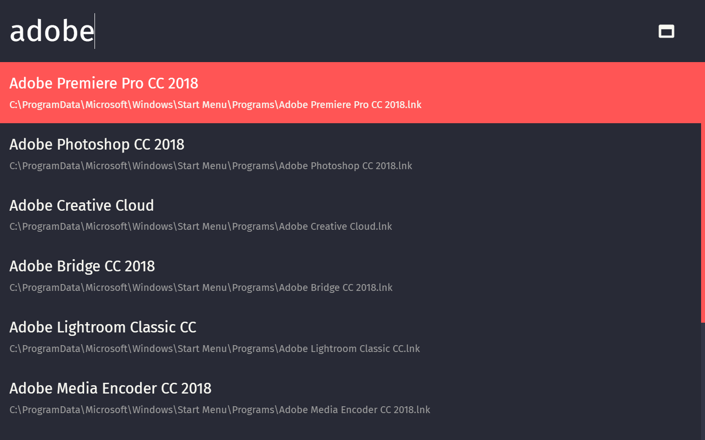

# electronizr

## An 'alt+space' launcher for Windows

This is an 'alt+space' launcher for Windows because I thought the default Windows 10 search function doesn't always do what I want.


## Table of Contents

* [Quick Tutorial](#quick-tutorial)
* [Installation](#installation)
* [Features](#features)
* [Customization](#customization)
* [Color Themes](#color-themes)
* [Roadmap](#roadmap)
* [Development](#development)
* [License](#license)

## Quick Tutorial

* Press `alt+space` to show/hide the main program
* Start typing a program name you're looking for
* Press `Enter` to launch the highlighted program 
* Use the arrow keys to scroll through the search result

## Installation

> Note: because the executables are not signed, Windows will probalby prevent you from executing the installer or the program itself. You can just click "Run anyway" to install the program.

### Installer / Zip

1. Download latest version here: [https://github.com/oliverschwendener/electronizr/releases](https://github.com/oliverschwendener/electronizr/releases)
2. Run the installer / Unzip
3. Create a shortcut in the Windows startup folder for autostart

### Manual installation

* Install [NodeJS](https://nodejs.org/)
* Install [Yarn](https://yarnpkg.com/)
* Clone Repo or Download ZIP
* Install npm packages:
    * `$ yarn`
* Transpile JS and SCSS files:
    * `$ yarn build`
* Package app:
    * `$ yarn package`
* Your application is now in the `dist/` folder
* Create a shortcut to `electronizr.exe` in the windows startup folder (`C:\Users\<your-username>\AppData\Roaming\Microsoft\Windows\Start Menu\Programs\Startup`) to run the application on windows logon

## Features

### Search

* Start typing a program name
* Use arrow keys to scroll up and down
* Press `Enter` to open the selected program

### Custom shortcuts

* You can set up custom shortcuts with a `Shortcut` and `Path`
    * For Example: if the Shortcut is `vsc` and the Path is `C:\ProgramData\Microsoft\Windows\Start Menu\Programs\Visual Studio Code\Visual Studio Code.lnk` you can start Visual Studio Code just by entering `vsc`
* You can set up your custom shortcuts with `ezr:config`

### Open URLs with your default web browser

* Start typing a URL
* Press `Enter` to open the URL in your default web browser

### Use web search engines

* Type `g?yourSearchTerm` to search something with Google's web search engine
* You can set up custom web search engines with `ezr:config`

### Execute command line tools

* Start a command line tool with the `>` prefix
    * For example: `>ipconfig /all`
* You can see only the output of the command line tool (stdout)

### Browse local files

* You can browse local files by entering a filepath
    * For example: `C:\Users`
* Press `Enter` to open file or folder
* Press `Tab` for autocompletion
* Press `Ctrl+Space` to preview a file or folder

### Keyboard shortcuts

* `Ctrl+O` to open the selected programs file location
* `Ctrl+space` to open preview
* `Shift+ArrowUp` and `Shift+ArrowDown` to browse your input history
* `F6` or `Ctrl+L` to focus on the input textbox


## Customization

You can customize your application with 'ezr:config'. All Settings, customization and user history are stored in the `~/electronizr.config.json` file. If there is no config file run the application once, then it should create one.

### Options

* `plugins` Array of plugin objects - A list of plugins.
    * `plugin` Object - Defines a plugin.
        * `name` String - Represents the name of the plugin.
        * `active` Boolean - Defines if the plugin is activated.
* `keyboardShortcut` String - Keyboard shortcut to show/hide electronizr. Default is `alt+space`.
    * Available keyboard shortcuts: [Electron Accelerator](https://github.com/electron/electron/blob/master/docs/api/accelerator.md)
* `size` Object - Defines the window size.
    * `width` Integer - Window's width in pixels. Default is `860`.
    * `height` Integer - Window's height in pixels. Default is `585`.
* `zoomFactor` Integer - Window's zoom factor, 1 represents 100%. Default is `1`.
* `fullscreen` Boolean - Whether the window should show in fullscreen. Default is `false`.
* `colorTheme` String - Sets the color theme to one of the [available color themes](#color-themes). Default is `osc-dark-blue`.
* `folders` String[] - A List of the folders you want to search. It's recommended not to add a folder with a lot of files because that would slow down the search function drastically. Default are the `Start Menu` and `Desktop` folders.
* `rescanInterval` Integer - Interval to rescan the specified folders (in seconds). Min=`1`, Max=`3600`. Default is `30`.
* `webSearches` Array of webSearch Objects - A list of custom web search engines. Default is the `Google` web search.
    * `webSearch` Object - Defines a custom web search engine.
        * `name` String - Represents the displayed name of your search engine.
        * `prefix` String - Represents the prefix for your search engine. For example if the prefix is `g` you can type in `g?<your-search>` to search.
        * `url` String - Represents the url for the search engine. For example Google's url for the search engine is `https://google.com/search?q=<your-search>`.
        * `icon` String (optional) - Represents a font-awesome icon which appears for your custom search engine. For example the [Google icon](http://fontawesome.io/icon/google/) is `fa fa-google`.
* `customShortcuts` Array of customShortcut Objects - A list of custom shortcuts.
    * `customShortcut` Object - Defines a custom shortcut.
        * `name`: String - Represents the name for the shortcut. For example `Code`.
        * `shortCut`: String - Represents the keyword for the shortcut. For example `vsc`.
        * `execArg`: String - Represents the execution argument for the shortcut. For Example `C:\ProgramData\Microsoft\Windows\Start Menu\Programs\Visual Studio Code\Visual Studio Code.lnk`.
* `favorites` String[] - This is where the applications stores your most used applications. You should not modify this.

## Color Themes

### osc-dark-blue


### osc-light-blue



### atom-one-dark



### dracula-dark-blue



### dracula-purple



### dracula-red



## Roadmap

* Project Renaming + wew icon/logo
* Using Typescript
* Unit & integration tests
* Mac OS Support

## Development

### Requirements

* [Git](https://git-scm.com/)
* [NodeJS](https://nodejs.org/)
* [Yarn](https://yarnpkg.com/)

### Set up

```
$ git clone https://github.com/oliverschwendener/electronizr
$ cd electronizr
$ yarn install
```

### Run

```
$ yarn watch
$ yarn start
```

**Note**: the gulp task watches your Javascript and CSS files and runs the associated gulp task if there is any change.

### Package

```
$ yarn package
```

**Note**: the default output location for the packaging is `dist/win-unpacked`.

## License

Copyright (c) Oliver Schwendener. All rights reserved.

Licensed under the [MIT](LICENSE) License