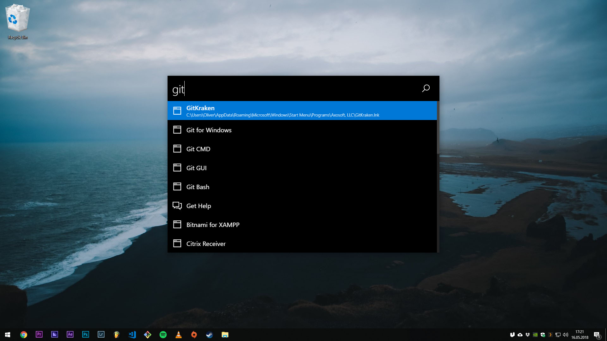
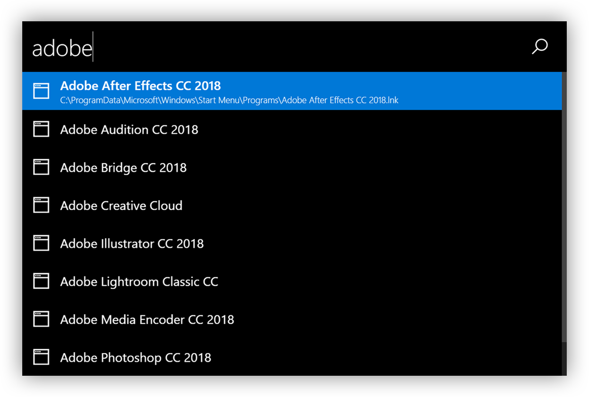
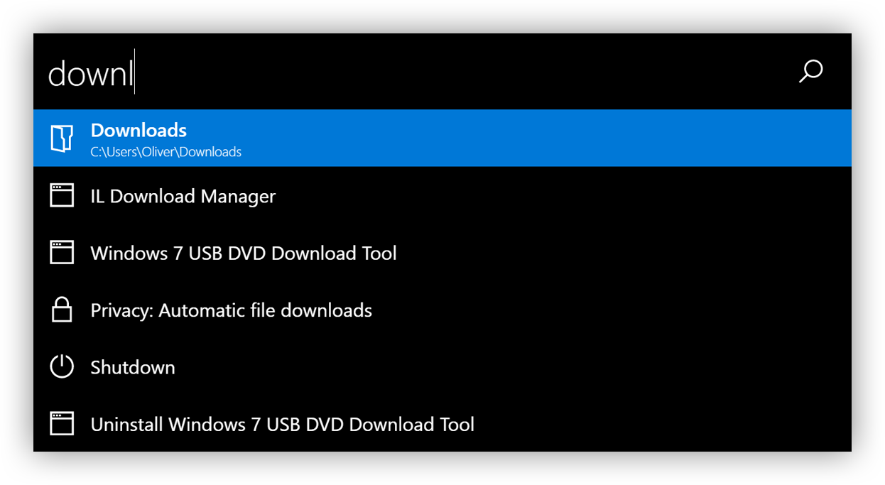
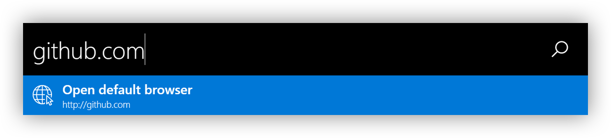
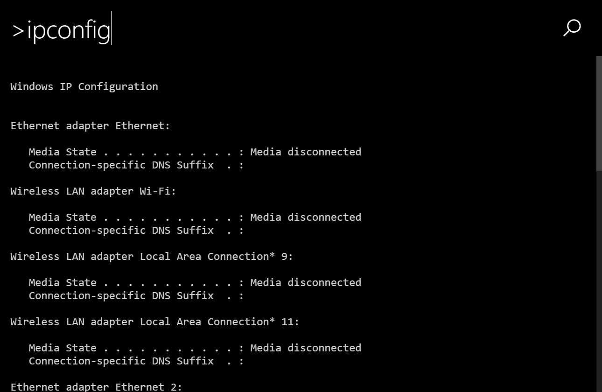
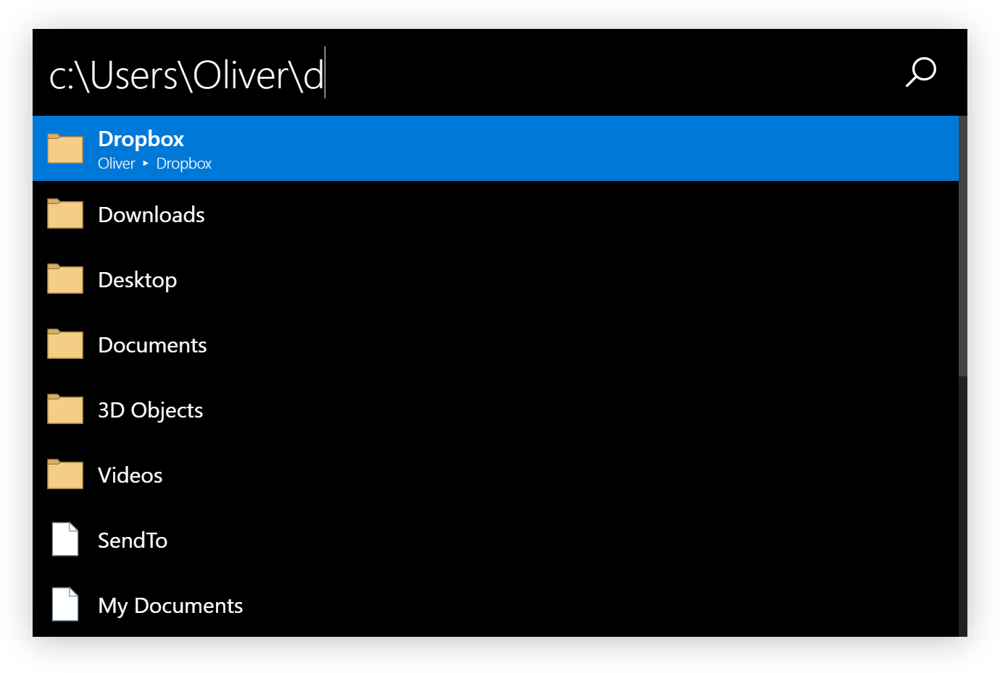
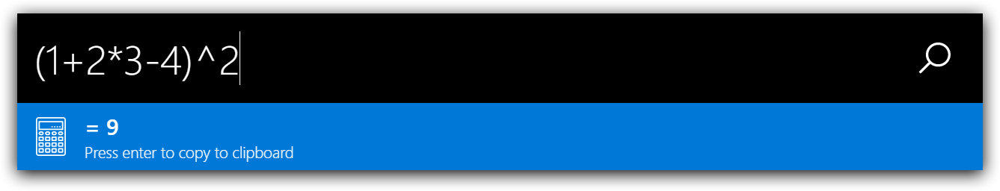
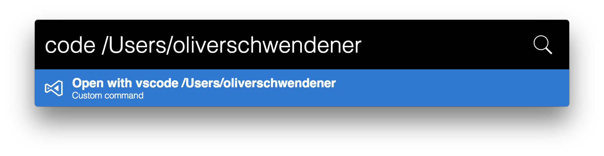
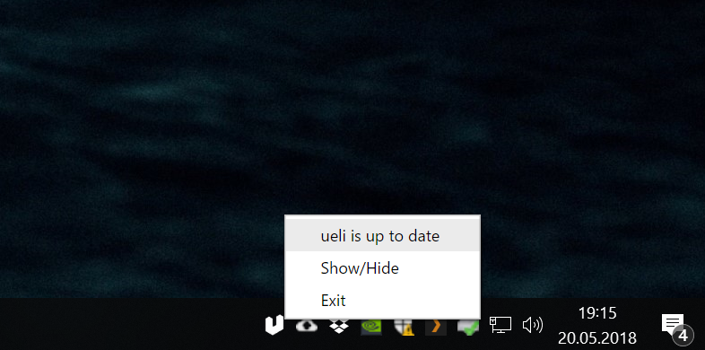

# ueli

This is a keystroke launcher for Windows and macOS.



## Table of contents

* [Installation](#installation)
* [Quick tutorial](#quick-tutorial)
* [Features](#features)
* [Customization](#customization)
* [Privacy](#privacy)
* [Roadmap](#roadmap)
* [Development](#development)
* [Alternatives](#alternatives)
* [License](#license)

## Installation

### Installer / Zip

> Note: because the executables are not signed Windows will probably prevent you from executing the installer or the program itself. You can click "Run anyway" to install/run the program.

* Download the latest version [here](https://github.com/oliverschwendener/ueli/releases)
* Run the installer or unzip
* Run the application

## Quick tutorial

* Press the global hot key to show/hide the window (default is `alt+space`)
* Start typing a program name
* Press Enter to launch the program

## Features

### Program search

* You can search for installed programs
* Use the arrow keys to scroll up and down
* Presss Enter to launch the selected program



### Files and folder search

* You can search files and folders
* Press Enter to open the selected file/folder
* You can [customize](#customization) the folders which are scanned for files and folders



### Open URLs with your default web browser

* Type in a URL
* Press enter to open the URL with your default web browser



### Open default mail program

* Type in a email address
* Press enter to open your default mail program with an empty email to the specified email address


### Web search engines

* You can use web search engines with a prefix and `?`. 
    * Example: `g?{your search term}`


Default web search engines:

|Prefix|Web Search Engine|
|---|---|
|`d`|[DuckDuckGo](https://duckduckgo.com)|
|`g`|[Google](https://google.com)|
|`gi`|[Google Images](https://images.google.com)|
|`l`|[Linguee](https://www.linguee.de)|
|`w`|[Wikipedia](https://wikipedia.org)|
|`yt`|[YouTube](https://youtube.com)|

* You can [customize](#customization) web search engines like this:

``` json
"webSearches": [
    {
        "icon": "<svg>...</svg>",
        "name": "My Search Engine",
        "prefix": "m",
        "url": "https://my-search-engine.com/search?q="
    }
]
```

### Execute commandline tools

* Start a commandline tool with the `>` prefix
    * Example: `>ipconfig /all`
* Stop an executing commandline tool with `Ctrl+c`

> Note: you can **not** interact with the commandline tool. You only see the output.



### Browse file system

* You can browse your file system by typing in a filepath
    * Example: `C:\Users` or `/Applications`
* Press `Enter` to open the file or folder
* Press `Tab` for autocompletion



### Calculator

* Calculate simple math, matrix, symbolic function, convert unit and a lot more.
   * Example: 
      * `23 * 24 / 2 + (6 * 7) ^ 2`
      * `1 km/h to mile/h`
      * `a = [1, 2, 3]; a * 2`



### Custom commands

* You can [customize](#customization) custom commands to
    * Start command line tools
    * Open websites
    * Open files/folders
    * Launch programs

``` json
"customCommands": [
    {
        "name": "ping",
        "executionArgument": ">ping 8.8.8.8 -t",
        "icon": "<svg>...</svg>"
    },
    {
        "name": "Whatsapp",
        "executionArgument": "https://web.whatsapp.com",
        "icon": "<svg>...</svg"
    },
    {
        "name": "Data",
        "executionArgument": "C:\\Data"
    },
    {
        "name": "my-project",
        "executionArgument": "!code C:\\my-project"
    }
]
```



### Keyboard shortcuts

|Keyboard shortcut|Description|
|---|---|
|`Ctrl+o`|Open the selected program or file at it's location|
|`ArrowUp`|Scroll up|
|`ArrowDown`|Scroll down|
|`Shift+ArrowUp`|Browse user input history up|
|`Shift+ArrowDown`|Browse user input history down|
|`F6`, `Ctrl+l`|Set focus on user input|
|`F1`|Get help|

### Updater

To check if a new version is available right click on the tray icon. The first item in the context menu shows you if there is an update available or if you are running the latest version. If there is an update available click on "Download and install update".



## Customization

All settings are stored in `~/ueli.config.json`. You can modify this file to change the default values.

### Options

* `applicationFileExtensions` Array of string - Represents the file extensions which are used to find applications in the specified folders
* `applicationFolders` Array of string - Represents the folders which are scanned for applications
* `autoStartApp` Boolean - If the app should be started automatically when you log in
* `colorTheme` String - Defines the [color theme](#color-themes).
* `customCommands` Arraay of customCommand objects - A list of [custom commands](#custom-commands)
    * `executionArgument` String - Represents the execution argument for the custom command
    * `name` String - Represents the displayed name for the custom command
    * `icon` String - (Optional) Represents the svg icon for the custom command. If no icon is set default icon is used
* `fileSearchFolders` Array of string - Represents the folders which are scanned for files and folders (not recursively)
* `hotKey` String - Represents the hotkey to show/hide the window. [Available hot keys](https://github.com/electron/electron/blob/master/docs/api/accelerator.md)
* `logExecution` Boolean - If ueli should log the execution of applications, files and folders for better search results. Set to `false` if you want to disable logging.
* `maxSearchResultCount` Number - Maximum number of search results to be displayed
* `rescanInterval` Number - Interval in seconds to rescan the application folders
* `searchEngineThreshold` Number - Represents the threshold for fuzzy matching (min = 0, max = 1, lower means you have to be more precise with the user input)
* `searchOperatingSystemSettings` Boolean - If operting system settings and commands should appear in the search results
* `searchResultExecutionArgumentFontSize` Number - Represents the font size of the search result execution argument in pixels
* `searchResultHeight` Number - Represents the height of a search result box in pixels
* `searchResultNameFontSize` Number - Represents the font size of the search result name in pixels
* `userInputFontSize` Number - Represents the font size of the user input in pixels
* `userInputHeight` Number - Represents the height of the user input box in pixels
* `webSearches` Array of webSearch Objects - A list of [web search engines](#web-search-engines)
    * `webSearch` Object - Defines a web search engine
        * `icon` String - Represents the svg icon for the specific web search engine
        * `name` String - Represents the name of the web search engine
        * `prefix` String - Represents the prefix for your web search engine. For example if the prefix is `g` you can type in `g?{your search term}` to search
        * `url` String - Represents the url for the search engine to which the search term is appended to. For example `https://google.com/search?q=`
* `windowWith`: Number - Represents the width of the main window in pixels

### Color themes


* `atom-one-dark`
* `dark`
* `dark-mono`
* `light`
* `light-mono`

## Privacy

For better search results ueli is keeping track of the applications, files and folders you are accessing. All information is stored in `~/ueli.count.json`. If you don't want ueli to track your executions simply delete that file's content and disable logging via the [customization](#customization).

## Roadmap

* Add nice GUI to modifiy configuration
* Notify user when update is available
* Use vue components

## Development

### Build status

|Platform|Build status|
|---|---|
|Windows|[](https://ci.appveyor.com/project/oliverschwendener/ueli)|
|macOS||

### Code coverage

[](https://coveralls.io/github/oliverschwendener/ueli?branch=master)

### Requirements

* Git
* Node.js
* Yarn

### Setup

```
$ git clone https://github.com/oliverschwendener/ueli
$ cd ueli
$ yarn
```

### Run

```
$ yarn build
$ yarn start
```

> Note: there is also a watch task `$ yarn build:watch` which watches the stylesheets and typescript files and transpiles them automatically if there are any changes.

### Debug

> Note: for debugging you need Visual Studio Code

Choose one of these debug configurations:


### Run tests

```
$ yarn test:unit
$ yarn test:integration
```

### Code coverage

```
$ yarn test:unit --coverage
```

### Package

```
$ yarn package
```

## Alternatives

* [Launchy](https://www.launchy.net/)
* [Wox](https://github.com/Wox-launcher/Wox)
* [Alfred](https://www.alfredapp.com/)
* [Hain](https://github.com/hainproject/hain)
* [Zazu App](http://zazuapp.org/)
* [Cerebro](https://cerebroapp.com/)

## License

Copyright (c) Oliver Schwendener. All rights reserved.

Licensed under the [MIT](LICENSE) License.
