# ueli

This is a keystroke launcher for Windows and macOS.

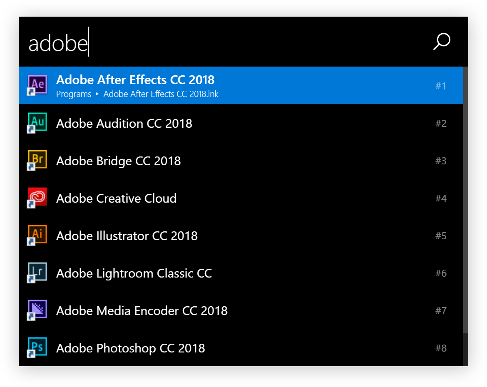

## Table of contents

* [Installation](#installation)
* [Quick tutorial](#quick-tutorial)
* [Features](#features)
* [Settings](#settings)
* [Updating](#updating)
* [Privacy](#privacy)
* [Known bugs](#known-bugs)
* [Development](#development)
* [Alternatives](#alternatives)
* [License](#license)
* [Release Notes](https://github.com/oliverschwendener/ueli/releases)

## Installation

### Installer / Zip

* Download the latest version [here](https://github.com/oliverschwendener/ueli/releases)
* Run the installer or unzip
* Run the application

> Note: because the executables are not signed Windows will probably prevent you from executing the installer or the program itself. You can click "Run anyway" to install/run the program.

### Installing via chocolatey repository

* Open a powershell with administration rights (Right click on your start button and click `Windows PowerShell (Admin)`
* Type `choco install ueli`
* Accept the upcoming prompt by entering `y` or run above command with `-y` switch
* Run the application

## Features

### Program search

* You can search for installed programs
* Press <kbd>Enter</kbd> to launch the selected program
* Press <kbd>Shift</kbd> <kbd>Enter</kbd> to launch the selected program as admin (Windows only)


### Files and folder search

* You can search files and folders
* Press <kbd>Enter</kbd> to open the selected file/folder
* You can [customize](#settings) the folders which are scanned for files and folders

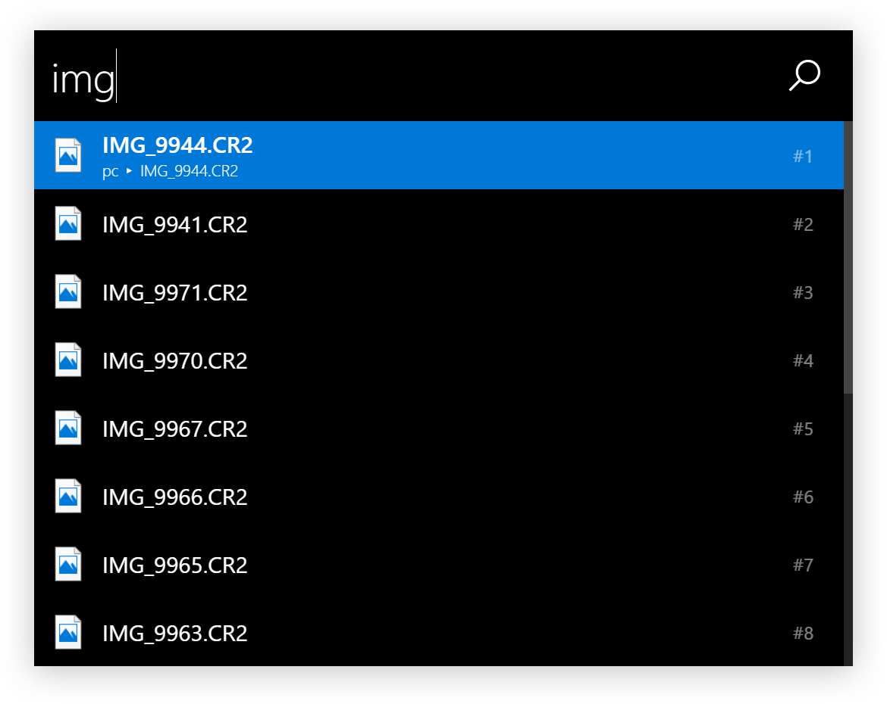

### Open URLs with your default web browser

* Type in a URL
* Press <kbd>Enter</kbd> to open the URL with your default web browser

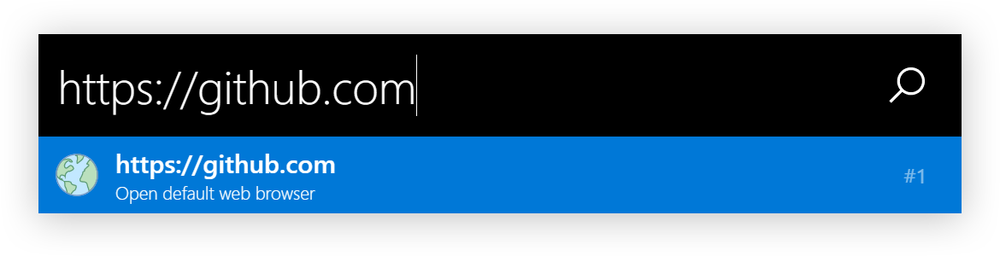

### Open default mail program

* Type in an email address
* Press <kbd>Enter</kbd> to open your default mail program with an empty email to the specified email address

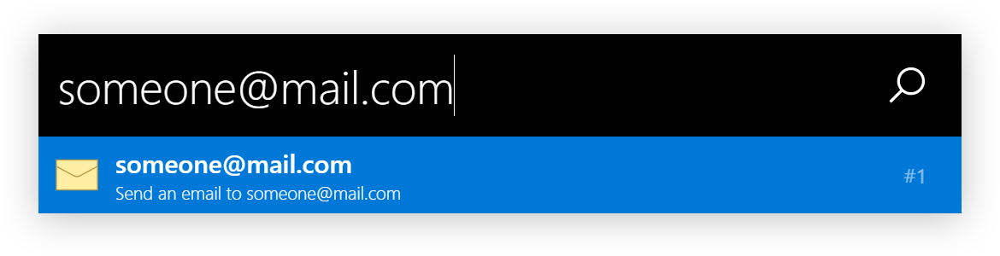

### Web search engines

* You can use web search engines with a prefix and `?`

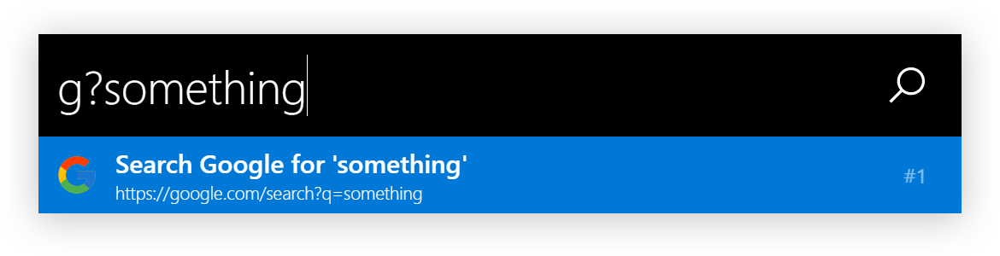

Default web search engines:

|Prefix|Web Search Engine|
|---|---|
|`d`|[DuckDuckGo](https://duckduckgo.com)|
|`g`|[Google](https://google.com)|
|`gi`|[Google Images](https://images.google.com)|
|`l`|[Linguee](https://www.linguee.de)|
|`w`|[Wikipedia](https://wikipedia.org)|
|`yt`|[YouTube](https://youtube.com)|

You can [customize](#settings) your own web search engines

#### Fallback web search engines

You can [customize](#settings) multiple fallback web search engines which are used if ueli does not find any other search results.

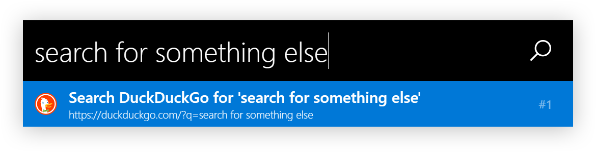

### Operating system settings

* Search for operating system settings

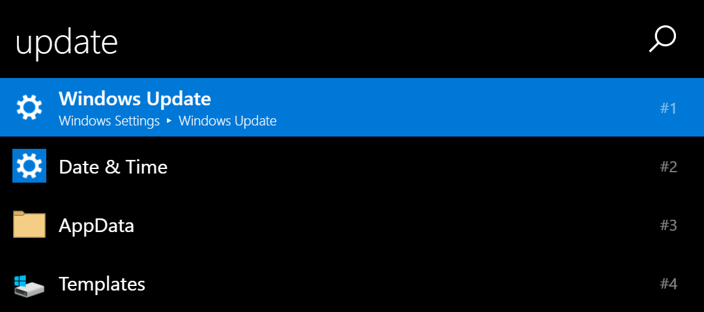

### Operating system commands

* Execute operating system commands like "Shutdown", "Restart", "Lock computer", etc.

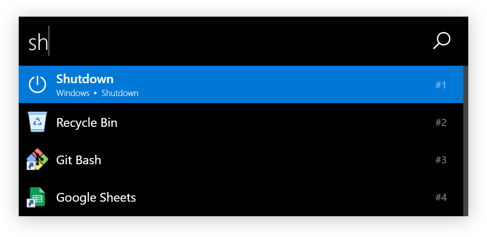

### Execute commandline tools

* Start a commandline tool with the `>` prefix
* Stop an executing commandline tool with <kbd>Ctrl</kbd> <kbd>c</kbd>

> Note: you can **not** interact with the commandline tool. You only see the output.

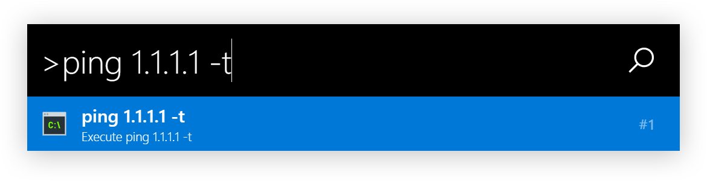

### Browse file system

* You can browse your file system by typing in a file path
* Press <kbd>Enter</kbd> to open the file or folder
* Press <kbd>Tab</kbd> for autocompletion

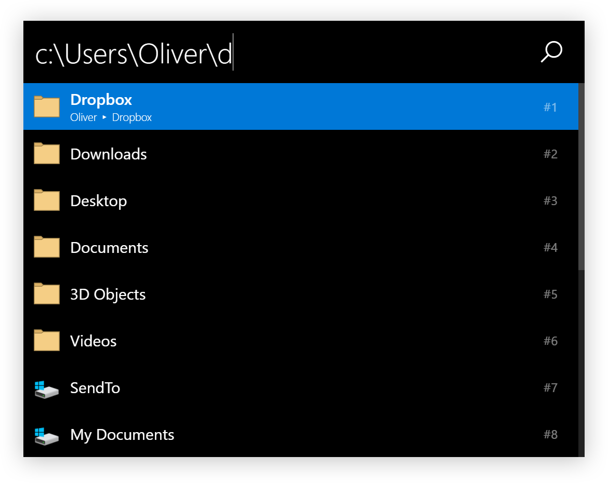

### Calculator

* Calculate simple math, matrix, symbolic function, convert units and a lot more
* Press <kbd>Enter</kbd> to copy the result to the clipboard


### Shortcuts

* You can [customize](#settings) shortcuts to
    * start command line tools
    * open websites
    * open files/folders
    * launch programs

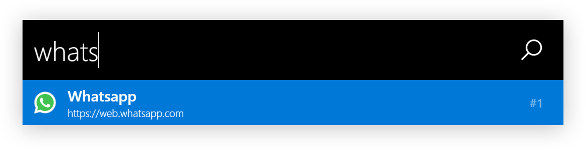

### Custom commands

* You can [customize](#settings) custom commands with parameters

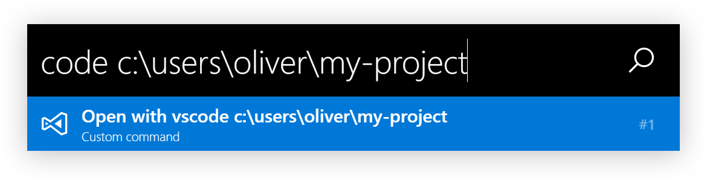

### Environment Variables

* Search for environment variables
* Press <kbd>Enter</kbd> to open the current file/folder
* Press <kbd>Tab</kbd> to autocomplete if it shows a valid file path

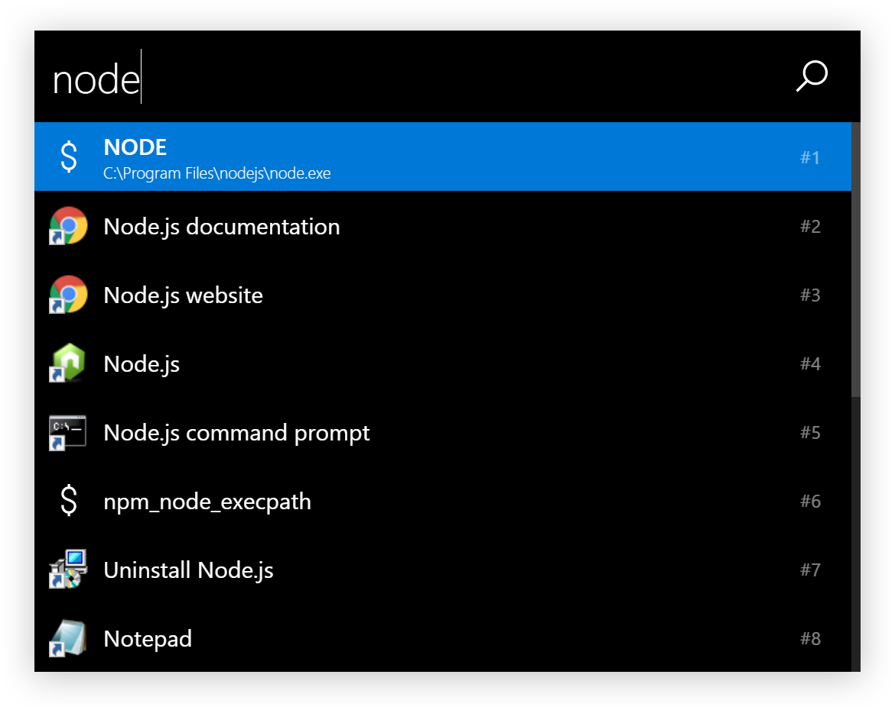

### Keyboard shortcuts

|Keyboard shortcut|Description|
|---|---|
|<kbd>Enter</kbd>|Execute selected search result|
|<kbd>Shift</kbd> <kbd>Enter</kbd>|Execute selected program as admin (Windows only)|
|<kbd>Tab</kbd>|Autocomplete file path|
|<kbd>Ctrl</kbd> <kbd>o</kbd>|Open the selected program or file at it's location|
|<kbd>↑</kbd>|Scroll up|
|<kbd>↓</kbd>|Scroll down|
|<kbd>Ctrl</kbd> <kbd>i</kbd>|Open settings|
|<kbd>Shift</kbd> <kbd>↑</kbd>|Browse user input history up|
|<kbd>Shift</kbd> <kbd>↓</kbd>|Browse user input history down|
|<kbd>F6</kbd>, <kbd>Ctrl</kbd> <kbd>l</kbd>|Set focus on user input|

## Settings

To open the settings press <kbd>Ctrl</kbd> <kbd>i</kbd> or search for `ueli settings`.

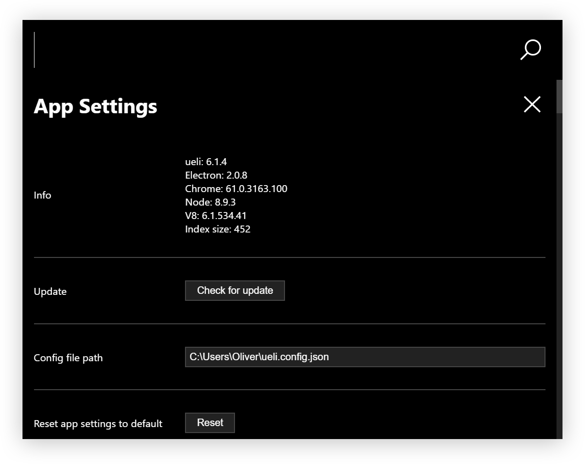

### Options

> All settings are stored in `~/.ueli/ueli.config.json`.

* `allowMouseInteraction` Boolean - If mouse interaction should be allowed.
* `alwaysShowOnPrimaryDisplay` Boolean - If ueli should always show up your the primary display. If set to false ueli will show up on the display your cursor is currently on.
* `applicationFileExtensions` Array of string - Represents the file extensions which are used to find applications in the specified folders.
* `applicationFolders` Array of string - Represents the folders which are scanned for applications.
* `autoStartApp` Boolean - If the app should be started automatically when you log in.
* `colorTheme` String - Defines the [color theme](#color-themes).
* `customCommands` Array of customCommand objects - A list of [custom commands](#custom-commands)
    * `name` String - Represents the displayed name of the custom command.
    * `executionArgument` String - Represents the execution argument for the custom command.
    * `prefix` String - Represents the prefix for the custom command.
    * `icon` String - Represents the svg icon for the custom command.
* `features` FeatureOptions
    * `calculator` Boolean - If the calculator feature is enabled.
    * `commandLine` Boolean - If the command line feature is enabled.
    * `customCommands` Boolean - If the custom command feature is enabled.
    * `email` Boolean - If the email feature is enabled.
    * `environmentVariables` Boolean - If the environment variables feature is enabled.
    * `fileBrowser` Boolean - If the file browser feature is enabled.
    * `fileSearch` Boolean - If the file search feature is enabled.
    * `programs` Boolean - If the programs feature is enabled.
    * `operatingSystemCommands` Boolean - If the operating system commands feature is enabled.
    * `operatingSystemSettings` Boolean - If the operating system settings feature is enabled.
    * `shortcuts` Boolean - If the shortcuts feature is enabled.
    * `ueliCommands` Boolean - If the ueli commands feature is enabled.
    * `webSearch` Boolean - If the web search feature is enabled.
    * `webUrl` Boolean - If the web url feature is enabled.
* `fileSearchBlackList`: Array of string - Represents a black list when files are searched. This has a small improvement on the performance when scanning a folder with a lot of files.
* `fileSearchOptions` Array of FileSearchOption objects (**only effective if `searchFiles` is set to `true`**).
    * `folderPath` String - Represents a folder which should be searched for files and folders.
    * `recursive` Boolean - If the specified folder should be searched recursively. **Be cautious with this option because it can slow down the application drastically.**
* `hotKey` String - Represents the hotkey to show/hide the window ([Available hot keys](https://github.com/electron/electron/blob/master/docs/api/accelerator.md)).
* `logExecution` Boolean - If ueli should log the execution of applications, files and folders for better search results. Set to `false` if you want to disable logging.
* `iconSet` IconSet - Represents the default icon set.
    * `appIcon` String - Represents the svg icon for applications.
    * `calculatorIcon` String - Represents the svg icon for the calculator.
    * `commandLineIcon` String - Represents the svg icon when typing in a command line command. 
    * `emailIcon` String - Represents the svg icon when typing in an email address.
    * `environmentVariableIcon` String - Represents the svg icon for environment variables.
    * `fileIcon` String - Represents the svg icon for files.
    * `folderIcon` String - Represents the svg icon for folders.
    * `operatingSystemSettingsIcon` String - Represents the svg icon for operating system settings.
    * `searchIcon` String - Represents the svg icon for the search icon on the top right.
    * `shortcutIcon` String - Represents the default svg icon for shortcuts and custom commands.
    * `urlIcon` String - Represents the svg icon when typing in an email address.
* `maxSearchResultCount` Number - Maximum number of search results to be displayed on one page.
* `rescanInterval` Number - Interval in seconds to rescan the application folders.
* `searchEngineLimit` Number - Represents the maximum of items that the search engine shows in the search results. The lower the better is the rendering performance.
* `searchEngineThreshold` Number - Represents the threshold for fuzzy matching (min = 0, max = 1, lower means you have to be more precise with the user input).
* `searchResultDescriptionFontSize` Number - Represents the font size of the search result description in pixels.
* `searchResultHeight` Number - Represents the height of a search result box in pixels.
* `searchResultNameFontSize` Number - Represents the font size of the search result name in pixels.
* `shortcuts` Arraay of shortcut objects - A list of [shortcuts](#shortcuts).
    * `executionArgument` String - Represents the execution argument for the shortcut.
    * `name` String - Represents the displayed name for the shortcut.
    * `icon` String - (Optional) Represents the svg icon for the shortcut. If no icon is set default icon is used.
* `showConfirmationDialog` Boolean - If a confirmation dialog should pop up when trying to execute "dangerous stuff" like operating system shutdown etc.
* `showSearchResultNumber` Boolean - If the search result number should be shown on the GUI.
* `showTrayIcon` Boolean - If the icon should appear in the system tray.
* `smoothScrolling` Boolean - If page scrolling for search results should be smooth or instant.
* `useNativeIcons` Boolean - If native operating system icons should be applied to apps and files.
* `userInputFontSize` Number - Represents the font size of the user input in pixels.
* `userInputHeight` Number - Represents the height of the user input box in pixels.
* `userStylesheet` String - Represents a path to a local stylesheet to modify the appearance of the window.
* `webSearches` Array of webSearch Objects - A list of [web search engines](#web-search-engines):
    * `webSearch` Object - Defines a web search engine.
        * `icon` String - Represents the svg icon for the specific web search engine.
        * `isFallback` Boolean - If the web search should act as [fallback](#fallback-web-search-engines)
        * `name` String - Represents the name of the web search engine.
        * `prefix` String - Represents the prefix for your web search engine. For example if the prefix is `g` you can type in `g?{your search term}` to search.
        * `priority` Number - Represents the priority of the web search engine when used as fallback (the higher the number the higher the web search engine appears in the search results).
        * `url` String - Represents the url for the search engine to which the search term is appended to. For example `https://google.com/search?q=` or `https://google.com/search?q={{query}}`.
        * `whitespaceCharacter` String - Represents a character or string which is used to encode whitespace.
* `windowMaxHeight` Number - Represents the maximum window height. Only used for command line output and settings view.
* `windowWidth`: Number - Represents the width of the main window in pixels.

### Color themes


#### Available color themes

* `atom-one-dark`
* `dark`
* `dark-mono`
* `light`
* `light-mono`

#### Custom color themes

You can customize your own color theme with a CSS file on your computer.

1. Create a CSS file on your computer
2. Add CSS variables in the `:root` section. For example:

    ``` CSS
    :root {
        --background-color: #21252b;
        --text-color: #ccc;
        --accent-color: #333842;
        --accent-text-color: #fff;
        --mono-font-color: #ccc;
        --scrollbar-foreground-color: #3d444f;
        --scrollbar-background-color: #1f2328;
    }
    ```

3. In the [settings](#settings) set `userStylesheet` to the CSS file you just created

4. Reload ueli

> You can completly overwrite uelis behaviour with your CSS file! See the [base stylesheet](https://github.com/oliverschwendener/ueli/tree/master/styles/app.css) of ueli.

### Icons

On [https://icons8.com](https://icons8.com/) you can find svg icons for almost everything!

## Updating

To check if you are running the latest version open the [settings](#settings). If there is an update available you can press the button to download and install the newer version.

## Privacy

For better search results ueli is keeping track of the applications, files and folders you are executing. All information is stored in `~/.ueli/ueli.count.json`. If you don't want ueli to track your executions simply delete that file's content and disable logging via the [settings](#settings).

## Known bugs

* ([#37](https://github.com/oliverschwendener/ueli/issues/37)) Window starts to move while typing when custom scaling in Windows is set.

## Development

### Build status

|Platform|Build status|
|---|---|
|Windows|[](https://ci.appveyor.com/project/oliverschwendener/ueli)|
|macOS||

### Code coverage

[](https://coveralls.io/github/oliverschwendener/ueli?branch=master)

### Requirements

* Git
* Node.js
* Yarn

### Setup

```
$ git clone https://github.com/oliverschwendener/ueli
$ cd ueli
$ yarn
```

### Run

```
$ yarn bundle
$ yarn start
```

> Note: there is also a watch task `$ yarn bundle:watch` which watches the typescript files and bundles them automatically if there are any changes.

### Debug

> For debugging you need Visual Studio Code

1. Go to `.vscode` folder
2. Make a copy of `launch.example.json` and rename it to `launch.json`
3. Select one of the preconfigured debug modes and start debugging


### Run tests

```
$ yarn test
```

### Code coverage

```
$ yarn test --coverage
```

### Package

```
$ yarn package:dir
```

## Alternatives

* [khanhas/ueli](https://github.com/khanhas/ueli)
* [Launchy](https://www.launchy.net/)
* [Wox](https://github.com/Wox-launcher/Wox)
* [Keypirinha](http://keypirinha.com/)
* [Alfred](https://www.alfredapp.com/)
* [Hain](https://github.com/hainproject/hain)
* [Zazu App](http://zazuapp.org/)
* [Cerebro](https://cerebroapp.com/)

## License

Copyright (c) Oliver Schwendener. All rights reserved.

Licensed under the [MIT](LICENSE) License.
