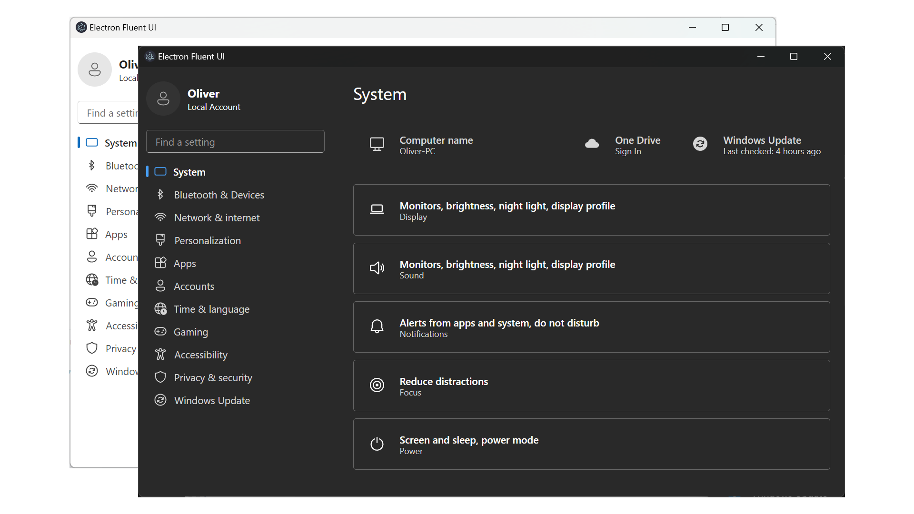

# Electron + Fluent UI React

This is a repo to quickly start the development of an electron application with [Fluent UI React](https://react.fluentui.dev/).



## Development

-   Install dependencies

    ```
    $ pnpm install
    ```

-   Run app in dev mode

    ```
    $ pnpm dev
    ```

-   Lint files

    ```
    $ pnpm lint
    ```

-   Perform typecheck

    ```
    $ pnpm typecheck
    ```

-   Build app

    ```
    $ pnpm build && pnpm package
    ```
