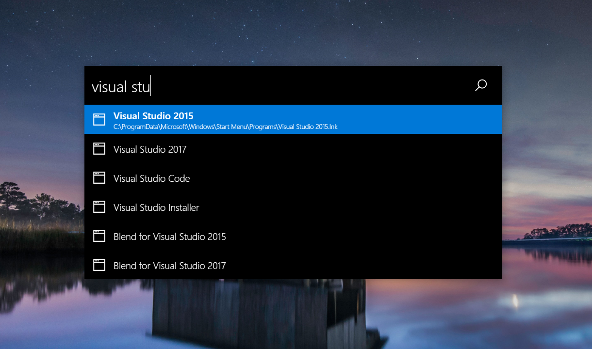

# ueli

This is an alt+space launcher for Windows and macOS.



## Installation

### Installer / Zip

> Note: because the executables are not signed Windows will probably prevent you from executing the installer or the program itself. You can click "Run anyway" to install/run the program.

* Download the latest version [here](https://github.com/oliverschwendener/ueli/releases)
* Run the installer or unzip
* Run the application

## Quick tutorial

* Press `alt+space` to show/hide the window
* Start typing a program name
* Press Enter to launch the program

## Features

### Search

* You can search for programs, files or folders in your home folder and system settings
* Use the arrow keys to scroll up and down
* Presss Enter to open the selected program/file/setting

### Open URLs with your default web browser

* Type in a URL
* Press enter to open the URL with your default web browser

### Use web search engines

* Type in `g?{your search term}` to search something on Google
* Default web search engines:
    * `g`: Google
    * `gi`: Google Images
    * `d`: DuckDuckGo
    * `yt`: YouTube
    * `l`: Linguee

### Execute commandline tools

* Start a commandline tool with the `>` prefix
    * Example: `>ipconfig /all`
* Stop an executing commandline tool with `Ctrl+c`

> Note: you can **not** interact with the commandline tool. You only see the output.

### Browse local files

* You can browse local files by typing in a filepath
    * Example: `C:\Users` or `/Applications`
* Press `Enter` to open the file or folder
* Press `Tab` for autocompletion

### Calculator

* Calculate simple math, matrix, symbolic function, convert unit and a lot more.
   * Example: 
      * `23 * 24 / 2 + (6 * 7) ^ 2`
      * `1 km/h to mile/h`
      * `a = [1, 2, 3]; a * 2`

### Keyboard shortcuts

* `Ctrl+o` to open the selected program or file at it's location
* `ArrowUp` to scroll up
* `ArrowDown`to scroll down
* `F6` or `Ctrl+l` to set focus on user input

## Customization

All settings are stored in `~/ueli.config.json`.

### Options

* `autoStartApp` Boolean - If the app should be started automatically when user logs in.
* `maxSearchResultCount` Number - Maximum number of search results to be displayed.
* `rescanInterval` Number - Interval in seconds to rescan for installed programs.
* `searchOperatinSystemSettings` Boolean - If operting system settings should appear in the search results. (Works only on Windows at the moment)
* `showHiddenFiles` Boolean - If hidden files should appear in the search results
* `webSearches` Array of webSearch Objects - A list of web search engines
    * `webSearch` Object - Defines a web search engine
        * `icon` string - Represents the svg icon for the specific web search engine
        * `name` string - Represents the name of the web search engine
        * `prefix` string - Represents the prefix for your web search engine. For example if the prefix is `g` you can type in `g?{your search term}` to search
        * `url` string - Represents the url for the search engine to which the search term is appended to. For example `https://google.com/search?q=`
* `windowWith`: Number - Represents the width of the main window

## Build status

|Platform|Build status|
|---|---|
|Windows|[](https://ci.appveyor.com/project/oliverschwendener/ueli)|
|macOS||

## Code coverage

[](https://coveralls.io/github/oliverschwendener/ueli?branch=dev)

## Roadmap

* Add input history browsing
* Add nice GUI to modifiy configuration
* Add option to add custom shortcuts
* Add option to change folders which are being scanned for programs and files

## Development

### Requirements

* Git
* Node.js
* Yarn

### Setup

```
$ git clone https://github.com/oliverschwendener/ueli
$ cd ueli
$ yarn
```

### Run

```
$ yarn build
$ yarn start
```

> Note: there is also a watch task `$ yarn build:watch` which watches the stylesheets and typescript files and transpiles them automatically if there are any changes.

### Debug

> Note: for debugging you need Visual Studio Code

Choose one of these debug configurations:


### Run tests

```
$ yarn test:unit
$ yarn test:integration
```

### Code coverage

```
$ yarn test:unit --coverage
```

### Package

```
$ yarn package
```

## Alternatives

* [Launchy](https://www.launchy.net/)
* [Wox](https://github.com/Wox-launcher/Wox)
* [Alfred](https://www.alfredapp.com/)
* [Hain](https://github.com/hainproject/hain)
* [Zazu App](http://zazuapp.org/)
* [Cerebro](https://cerebroapp.com/)

## License

Copyright (c) Oliver Schwendener. All rights reserved.

Licensed under the [MIT](LICENSE) License.
