# ueli

This is a keystroke launcher for Windows and macOS.

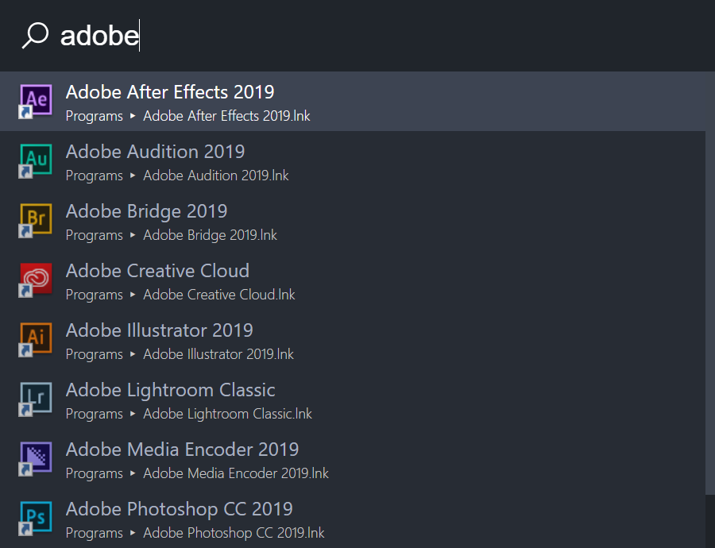

## Table of contents

-   [Installation](#installation)
-   [Features](#features)
-   [Keyboard shortcuts](#keyboard-shortcuts)
-   [Settings](#settings)
-   [Updating](#updating)
-   [Privacy](#privacy)
-   [Known bugs](#known-bugs)
-   [Development](#development)
-   [Alternatives](#alternatives)
-   [License](#license)
-   [Release notes](https://github.com/oliverschwendener/ueli/releases)

## Installation

### Installer / Zip

-   Download the latest version from here: https://ueli.app/#/download
-   Run the installer or unzip
-   Run the application

> Note: because the executables are not signed Windows and macOS will probably prevent you from executing the installer or the program itself.

### Installing via chocolatey repository

-   Open a powershell with administration rights (Right click on your start button and click `Windows PowerShell (Admin)`
-   Type `choco install ueli`
-   Accept the upcoming prompt by entering `y` or run above command with `-y` switch
-   Run the application

## Features

### Application Search

This plugin is searching for applications on your computer. You can specify the folders where your applications are installed and which file extension should be used to recognize an application.


### Browser bookmarks

This plugin enables you to search your browser bookmarks.

Currently supported browsers:

-   Google Chrome
-   Brave
-   Vivaldi
-   SideKick
-   Microsoft Edge

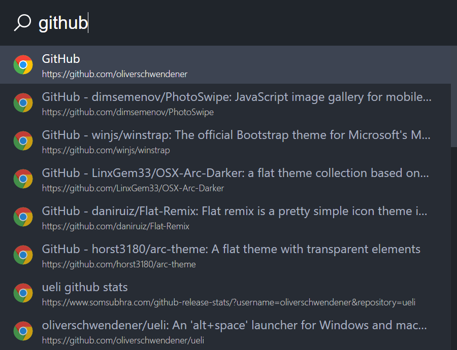

### Calculator

This Plugin lets you quickly do simple calculations.

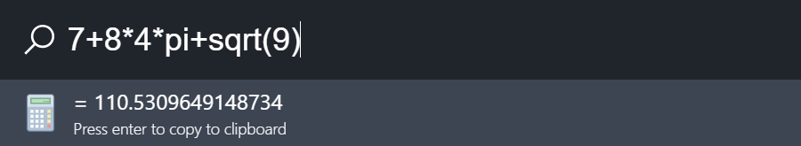

### Color Converter

This plugin enables you to quickly convert colors into different formats.

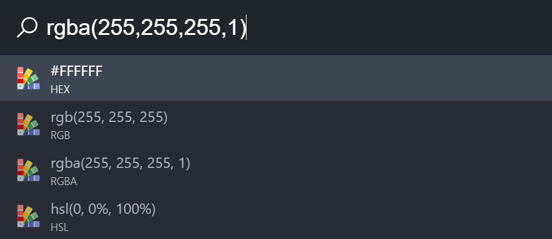

### Commandline

This plugin enables you to quickly execute commandline commands.

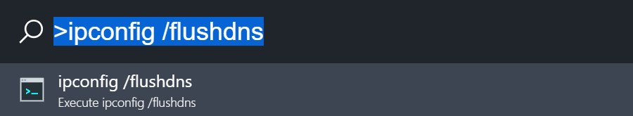

### Control panel (Windows only)

This plugin enables you to quickly find control panel items.


### Currency Converter

This plugin enables you to quickly convert currencies. The latest conversion rates are provided by https://exchangeratesapi.io/.

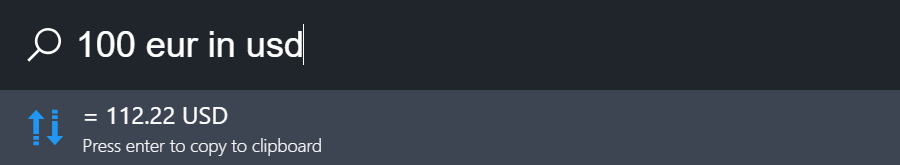

### Dictionary

This plugin enables you to quickly look up the definition and synonyms of words. It uses an unofficial Google Dictionary API (https://googledictionaryapi.eu-gb.mybluemix.net/)

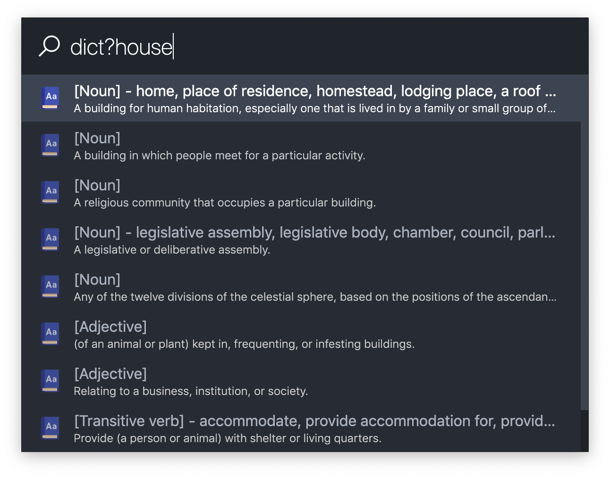

### Email

This plugin enables you to quickly start writing an email by typing in an email address.


### Everything (Windows only)

This feature enables you to use [Everything Search](https://www.voidtools.com) to find files and folders on your local file system.

1. Install "Everything" and the "Everything Command-line interface" from [https://www.voidtools.com/downloads](https://www.voidtools.com/downloads).
2. Specify the file path to `es.exe` in ueli's settings.

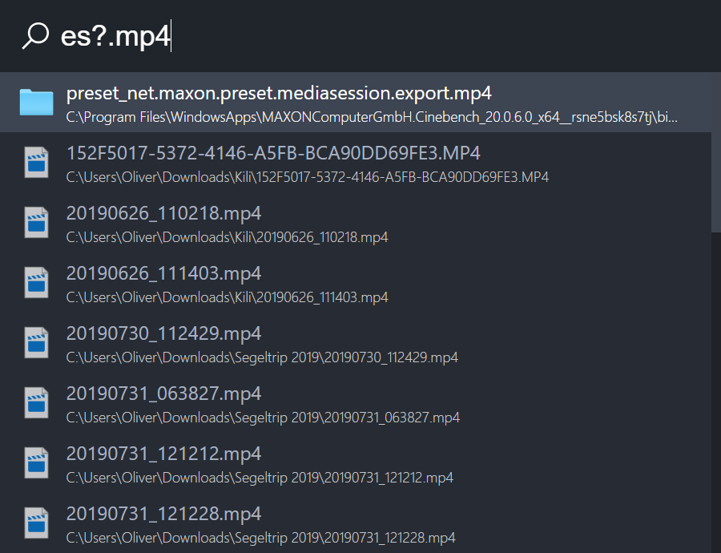

### mdfind (macOS only)

This plugin enables you to use the native macOS search to find files and folders on your local file system.

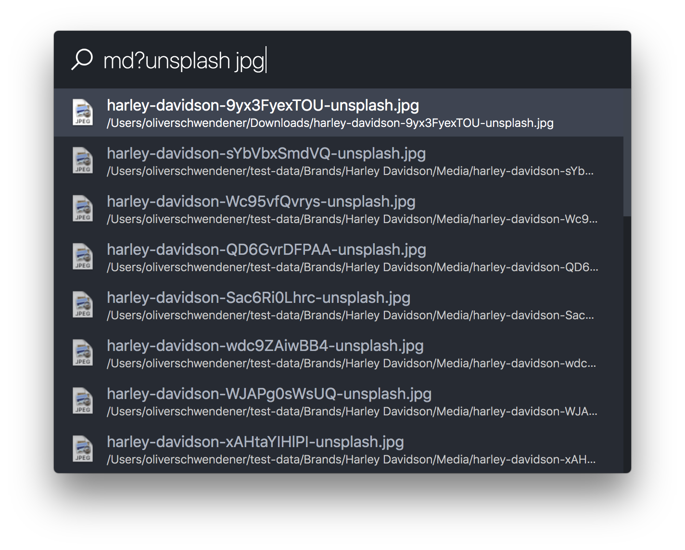

### File Browser

This plugin enables you to browse through your local file system. To start you have to enter a valid absolute filepath.

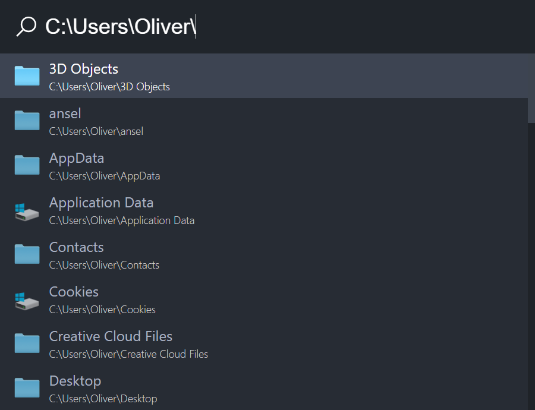

### Operating System Commands

Operating system commands are simple commands to control your operating system e.g. to shutdown or restart your computer.

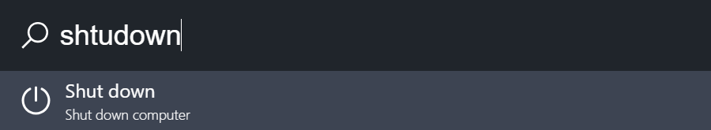

### Operating System Settings

This plugin enables you to quickly find operating system settings.

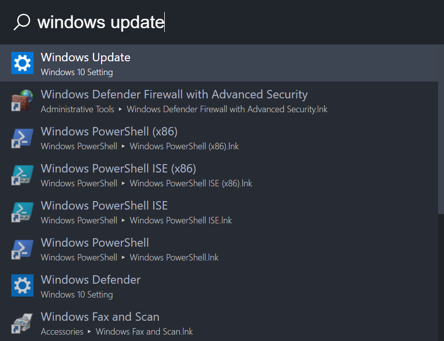

### Shortcuts

This plugin enables you to quickly open files or websites by setting up your own shortcuts.


### Simple Folder Search

This plugin enables you to quickly search for files or folders.

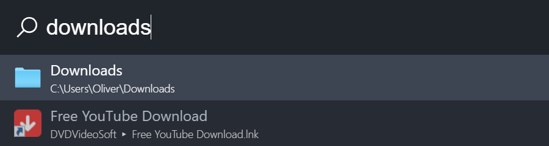

### Translation

This plugin enables you to quickly translate words or short sentences. It uses an unofficial [API](https://github.com/imankulov/linguee-api) for [Linguee](https://linguee.de) and may be unstable.


### UWP (Windows only)

This plugin enables you to find preinstalled UWP apps.

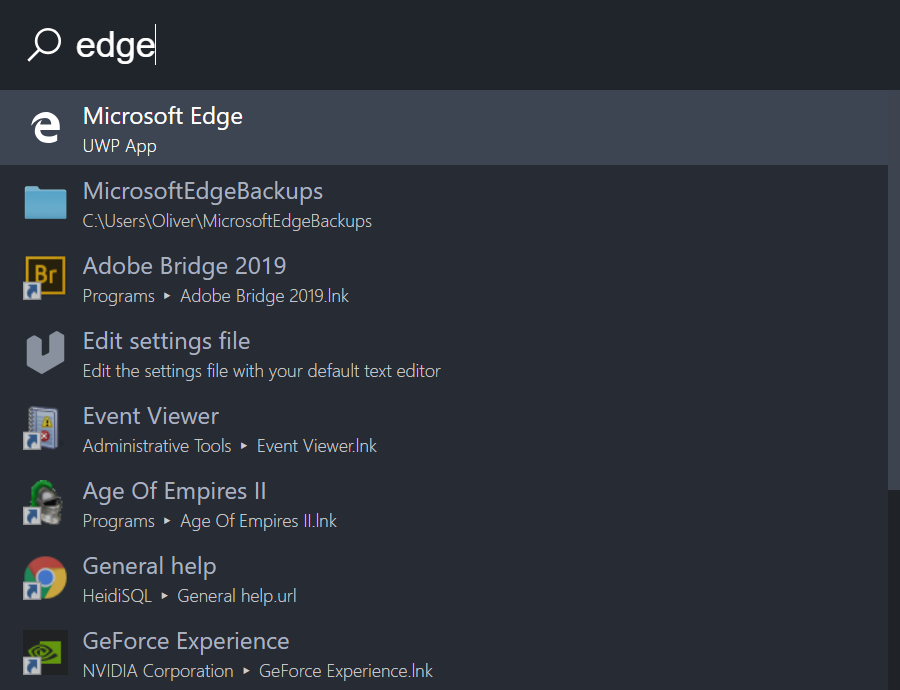

### URL

This plugin enables you to quickly open websites by typing in a URL.


### Web Search

This plugin enables you to quickly search the internet with your favorite web search engine by setting up your own web search engines.


### Workflow

This plugin enables you to quickly execute multiple things at once.


## Keyboard shortcuts

| Keyboard shortcut                   | Description                                                  |
| ----------------------------------- | ------------------------------------------------------------ |
| <kbd>Enter</kbd>                    | Execute selected search result                               |
| <kbd>Shift</kbd> <kbd>Enter</kbd>   | Execute selected program as admin (Windows only)             |
| <kbd>Tab</kbd>                      | Autocomplete file path                                       |
| <kbd>Ctrl</kbd> <kbd>o</kbd>        | Open the selected program or file at it's location (Windows) |
| <kbd>Cmd</kbd> <kbd>o</kbd>         | Open the selected program or file at it's location (macOS)   |
| <kbd>↑</kbd>                        | Scroll up                                                    |
| <kbd>↓</kbd>                        | Scroll down                                                  |
| <kbd>Ctrl or Cmd</kbd> <kbd>p</kbd> | Scroll up                                                    |
| <kbd>Ctrl or Cmd</kbd> <kbd>n</kbd> | Scroll down                                                  |
| <kbd>Ctrl</kbd> <kbd>i</kbd>        | Open settings (Windows)                                      |
| <kbd>Cmd</kbd> <kbd>,</kbd>         | Open settings (macOS)                                        |
| <kbd>Shift</kbd> <kbd>↑</kbd>       | Browse user input history up                                 |
| <kbd>Shift</kbd> <kbd>↓</kbd>       | Browse user input history down                               |
| <kbd>Ctrl</kbd> <kbd>l</kbd>        | Set focus on user input                                      |

## Settings

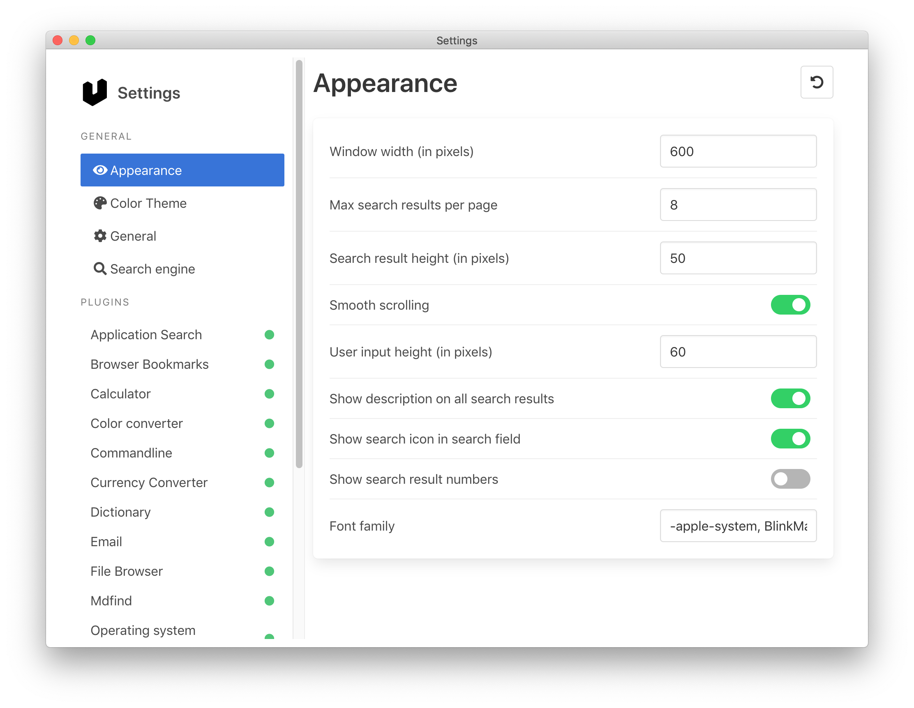

To open the settings simply search for "Settings" or press `Ctrl+i` on Windows or `Cmd+,` on macOS. Here you can start configuring the app to your needs by enabling/disabling features or changing the settings.

## Updating

The check if any updates are available open the settings. Under "General Settings" you can check if an update is available or not.

On Windows you can directly update the app. On macOS you have to manually download the newest release and replace the existing app.

## Privacy

For better search results ueli is keeping track of the applications, files and folders you are executing. If you don't want ueli to track your executions simply open the settings and click on the "three-dot" menu on the top right and choose "Clear execution log" and disable the option "Log execution".

## Known bugs

-   ([#37](https://github.com/oliverschwendener/ueli/issues/37)) Window starts to move while typing when custom scaling in Windows is set.
-   ([#92](https://github.com/oliverschwendener/ueli/issues/92)) If you see an error that says `spawn powershell.exe ENOENT` check if powershell is installed (should be installed in all recent Versions of Windows by default) and check if powershell is in the PATH variable.
-   ([#278](https://github.com/oliverschwendener/ueli/issues/278)) If you're on macOS Catalina you might miss some system apps (for example: Books or QuickTime Player). Try adding `/System/Applications` to your application search settings.

For more check [here](https://github.com/oliverschwendener/ueli/issues).

## Development

### Requirements

-   Git
-   Node 12.x.x
-   Yarn

### Setup

```
$ git clone https://github.com/oliverschwendener/ueli
$ cd ueli
$ yarn
```

### Run

```
$ yarn bundle
$ yarn start
```

### Debug

For debugging Visual Studio Code is recommended.

1. Go to .vscode folder
2. Make a copy of launch.example.json and rename it to launch.json
3. Select one of the preconfigured debug modes and start debugging

### Run tests

```
$ yarn test
```

### Package

#### Create portable version

```
$ yarn package:dir
```

#### Create installer

```
$ yarn package
```

## Alternatives

-   [khanhas/ueli](https://github.com/khanhas/ueli)
-   [Flow-Launcher](https://github.com/Flow-Launcher/Flow.Launcher)
-   [Launchy](https://www.launchy.net/)
-   [Wox](https://github.com/Wox-launcher/Wox)
-   [Keypirinha](http://keypirinha.com/)
-   [Alfred](https://www.alfredapp.com/)
-   [Hain](https://github.com/hainproject/hain)
-   [Zazu App](http://zazuapp.org/)
-   [Cerebro](https://cerebroapp.com/)

## Thanks

Thanks to [David Gabathuler](https://davidgabathuler.ch) for the logo!

## License

Copyright (c) Oliver Schwendener. All rights reserved.
Licensed under the [MIT](LICENSE) License.
