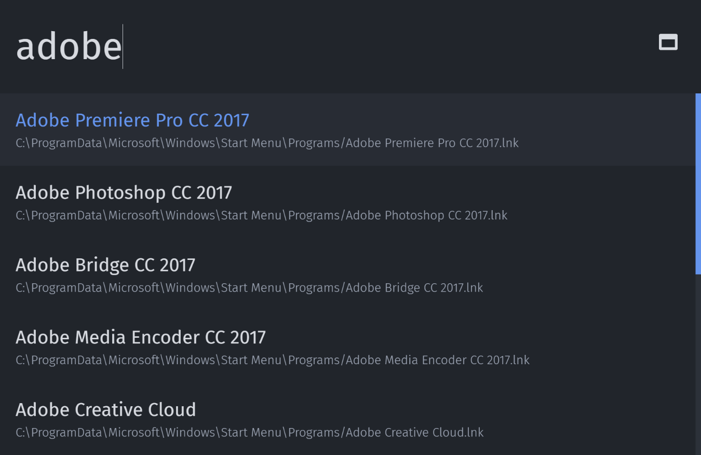
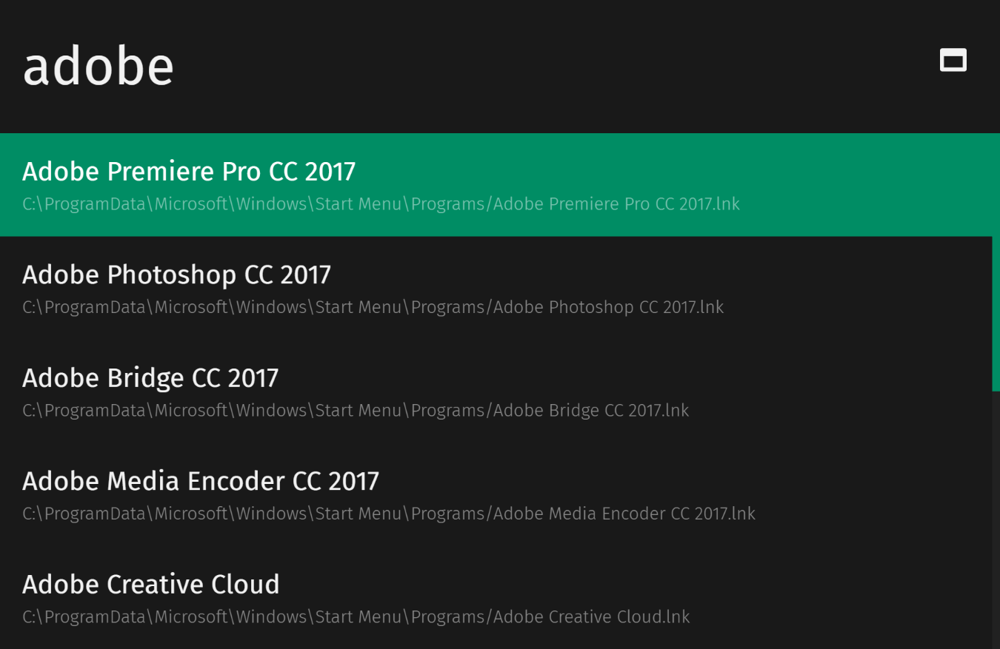
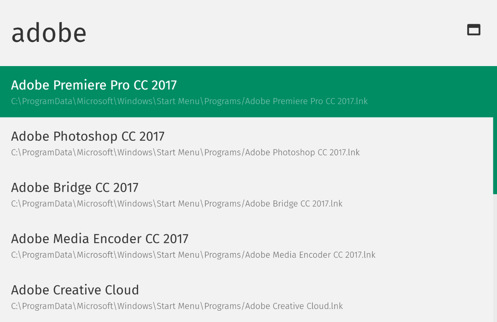

# electronizr

## An 'alt+space' launcher for Windows
This is an 'alt+space' launcher for Windows because I thought the default Windows 10 search function doesn't always do what I want.



## Table of Contents
* [Quick Tutorial](#quick-tutorial)
* [Installation](#installation)
* [Features](#features)
* [Customization](#customization)
* [Color Themes](#color-themes)
* [electronizr specific commands](#electronizr-specific-commands)
* [Planned Features](#planned-features)

## Quick Tutorial
* Hit `alt + space` to show/hide the main program
* Start typing a program name you're looking for
* Hit enter to launch the highlighted program 
* Use tab/shift+tab to scroll through the search result

## Installation
### Download
You can download the latest version [here](http://electronizr.oliverschwendener.ch)

### Manual Installation
1. Install [Node](https://nodejs.org/en/) (>= 7.8.0)
2. Clone Repo or Download ZIP
3. Install npm packages
    * `$ npm install`
4. Run gulp build task
    * `$ gulp build`
5. Run build script
    * `$ npm run build`
6. Your application is now in the `dist/` folder
7. Create a shortcut to `electronizr.exe` in the windows startup folder (`C:\Users\<your-username>\AppData\Roaming\Microsoft\Windows\Start Menu\Programs\Startup`) to run the application on windows logon    

## Features
* Search while typing
* Launch a program by hitting `Enter`
* Launch commandline tool with a `>` prefix
    * e.g. `>ipconfig /all`
* Open a web URL with your default web browser
    * e.g. `google.com`
* Use Google search function with a `g:` prefix
    * e.g. `g:how can i exit vi`
* Use your own web search engines
* Open Folder or Files with entering a file path
    * e.g. `C:\temp` or `C:\temp\myphoto.jpg`
* Available color themes:
    * atom-one-dark
    * osc-dark-blue
    * osc-dark-green
    * osc-light-blue
    * osc-light-green

## Customization
All Settings, customization and user history are stored in the `ezr_config.json` file in your home folder.
If there is no config file run the application once, it should create one.

* colorTheme
``` javascript
colorTheme: "atom-one-dark"
```

* highlightColorTheme (syntax highlighting when preview a text file)
    * use a [highlight.js](https://highlightjs.org/) color theme
``` javascript
highlightColorTheme: "atom-one-dark"
```

* scrollAnimationSpeed ('fast' / 'slow' / number(int))
``` javascript
scrollAnimationSpeed: 'fast'
```

* welcomeMessage
``` javascript
welcomeMessage: "What are you looking for?"
```

* folders
``` javascript
[
    "C:\\ProgramData\\Microsoft\\Windows\\Start Menu",
    "C:\\Users\\<your-username>\\Downloads",
    "C:\\Users\\<your-username>\\Desktop"
]
```

* webSearches
``` javascript
[
    {
        name: "Google",
        prefix: "g",
        url: "https://google.com/search?q=",
        icon: "fa fa-google"
    }
]
```

* customCommands
``` javascript
[
    {
        code: "c",
        path: "C:\\ProgramData\\Microsoft\\Windows\\Start Menu\\Programs\\Google Chrome.lnk"
    }
]
```

## Color Themes
### atom-one-dark


### osc-dark-blue


### osc-dark-green


### osc-light-blue


### osc-light-green


## electronizr specific commands
|Command|Description|
|---|---|
|ezr:reload|Reload electronizr|
|ezr:config|Open config file|
|ezr:reset-history|Resets the user history|
|ezr:exit|Exit the application| 

## Planned Features
* Installer / Prebuilt Downloads
* Access Control Panel items