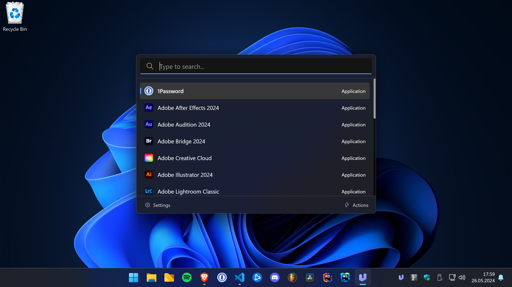

# Ueli

Ueli is a keystroke launcher for Windows, macOS and Linux.



> Ueli v9.0.0 is currently under development, more documentation is about to come.

# Development

## Requirements

Make sure you have [pnpm](https://pnpm.io/) installed.

## Development

-   Install dependencies

    ```
    $ pnpm install
    ```

-   Run app in dev mode

    ```
    $ pnpm dev
    ```

-   Lint files

    ```
    $ pnpm lint
    ```

-   Perform typecheck

    ```
    $ pnpm typecheck
    ```

-   Run tests

    ```
    $ pnpm test
    ```

-   Build and package app

    ```
    $ pnpm build && pnpm package
    ```
