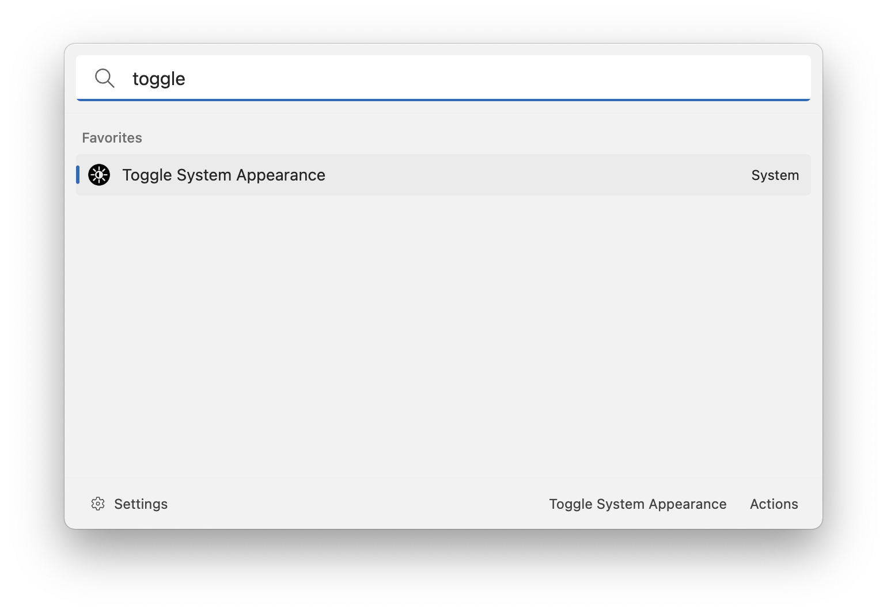

# Appearance Switcher

This extension allows you to easily switch between light and dark theme on your operating system. Search for "Toggle System Appearance" and press enter to switch from light to dark or from dark to light theme.

## Known bugs

On Windows, currently the theme switch does not work as expected: the task bar won't update it's color unless `explorer.exe` will be restarted.

## About this extension

Author: [Oliver Schwendener](https://github.com/oliverschwendener)

Supported operating systems:

- Windows
- macOS
