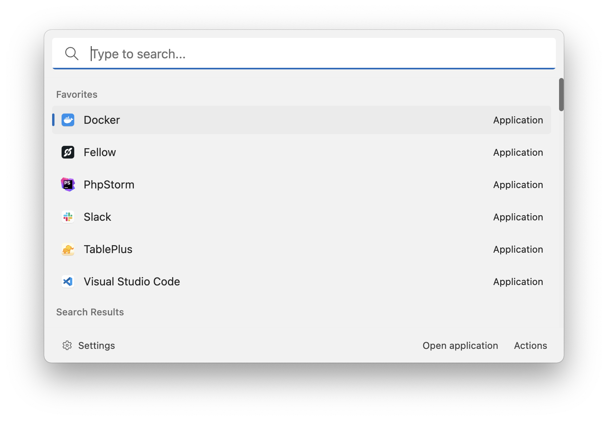

# Application Search

This extension allows you to search for applications installed on your computer.

Author: [Oliver Schwendener](https://github.com/oliverschwendener)

Supported operating systems:

-   Windows
-   macOS
-   Linux (with Cinnamon or Gnome Desktop environment)

## Settings

### Windows

-   Folders: the list of folders where Ueli will look for application files.
-   File Extensions: the list of file extensions that represent applications.
-   Include Windows Store apps: wether to include apps installed from the Windows Store.

### macOS

-   Application Folders: the list of folders where Ueli will look for `.app` files.

### Linux

-   Application Folders: the list of folders where Ueli will look for applications.
