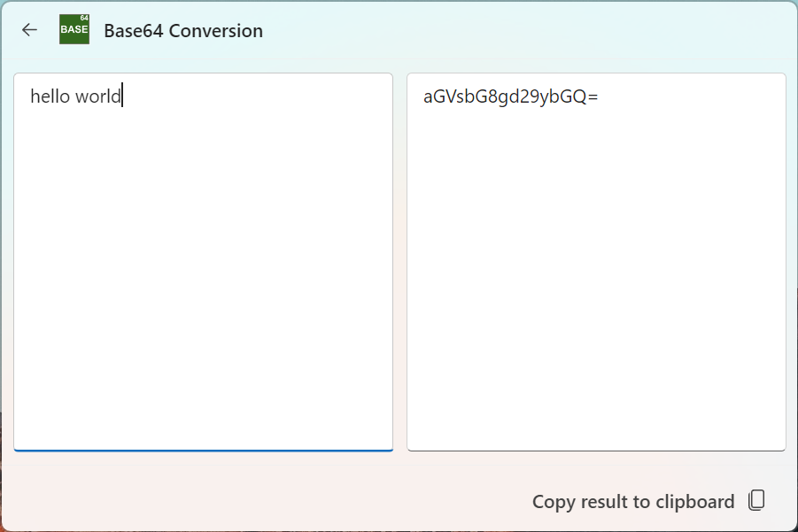
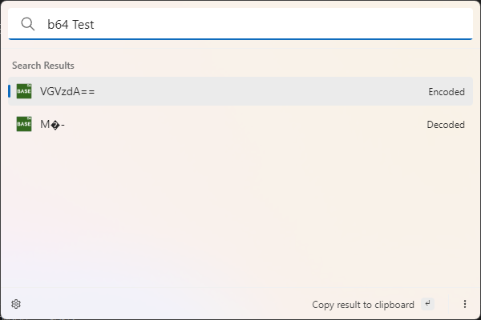

# Base64 Conversion

This extension allows you to encode and decode base64 strings. Enter a string on the left and you will see the base64 encoded version on the right. To decode base64 string just enter something on the right side to see the plain text on the left.

This extension also supports instant results when using b64 (encode + decode), b64e (encode) or b64d (decode) prefixes in the search bar.--

## About this extension

Author: [Christopher Steiner](https://github.com/ChristopherSteiner)

Supported operating systems:

- Windows
- macOS
- Linux
