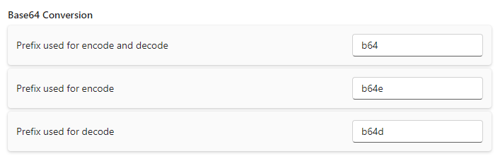

# Base64 Conversion

This extension allows you to encode and decode base64 strings. Enter a string on the left and you will see the base64 encoded version on the right. To decode base64 string just enter something on the right side to see the plain text on the left.

This extension also supports instant results when using encode/decode (default: b64), encode (default: b64e) or decode (default: b64d) prefixes in the search bar.

## Settings

- **Encode/Decode Prefix**: Prefix used for encoding and decoding the search text
- **Encode Prefix**: Prefix used for encoding the search text
- **Decode Prefix**: Prefix used for decoding the search text

## About this extension

Author: [Christopher Steiner](https://github.com/ChristopherSteiner)

Co-Author: [Marco Senn-Haag](https://github.com/MarcoSennHaag)

Supported operating systems:

- Windows
- macOS
- Linux
