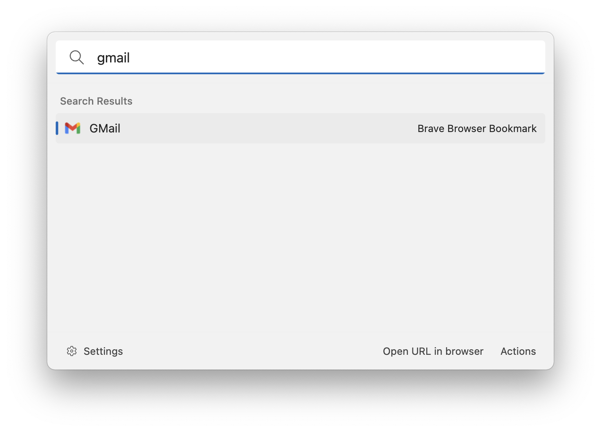

# Browser Bookmarks

This extension allows you to search for your browser bookmarks. After you enabled the extension just start searching for your bookmarks by name. Press enter to open the browser bookmark with your default browser.

## Settings

-   Browsers: the list of browsers in which you want to search for bookmarks
-   Search result style: the style how the search result items will appear
    -   Name only: the search result item will only show the name of the bookmark
    -   URL only: the search result item will only show the URL of the bookmark
    -   Name & URL: the search result item will show the name and the URL of the bookmark
-   Icon type: the icon that will be shown for the search result item

    -   Favicon: Ueli will try to fetch the icon for the website
    -   Browser icon: Ueli will show the icon for the browser from which the browser bookmark was found

## About this extension

Author: [Oliver Schwendener](https://github.com/oliverschwendener)

Supported operating systems:

-   Windows
-   macOS

Supported browsers:

-   Arc
-   Brave Browser
-   Firefox
-   Google Chrome
-   Microsoft Edge
-   Yandex Browser
