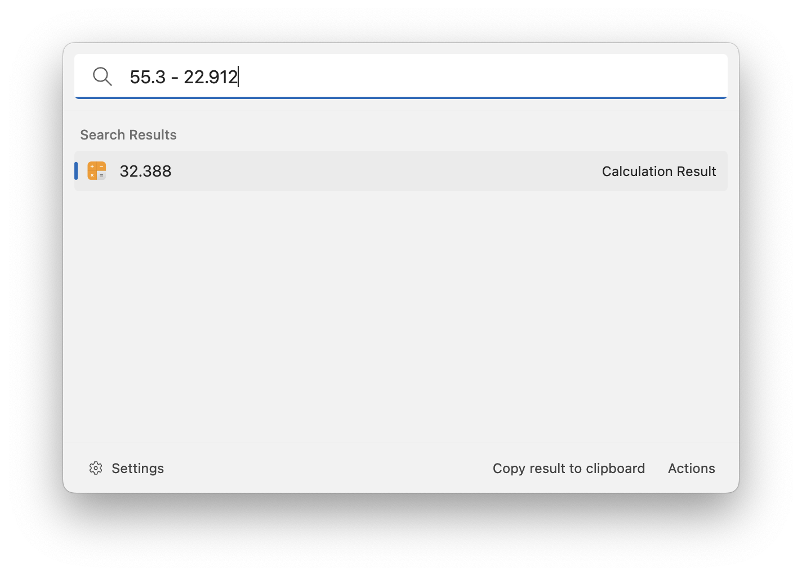

# Calculator

This extension allows you to do simple calculations directly in the search field. Type in a calculation, for example `55.3 - 22.912` and Ueli will show you the result. Press enter to copy the result to the clipboard. You can also do unit conversions, for example `2 inch to cm` or `1l in cm^3`. Under the hood, Ueli is using [mathjs](https://mathjs.org/) to do all the calculations. Check out their website for more details.

## Settings

- Precision: the number of decimals, to which the result will be rounded.
    - When the precision is set to `1` the result of `1/3` will be `0.3`.
    - When the precision is set to `8` the result of `1/3` will be `0.33333333`.
- Decimal separator: the symbol used to indicate the boundary between the whole number part and the fractional part of a decimal number.
- Argument separator: the symbol used to separate arguments in advanced calcuations.

## About this extension

Author: [Oliver Schwendener](https://github.com/oliverschwendener)

Supported operating systems:

- Windows
- macOS
- Linux
