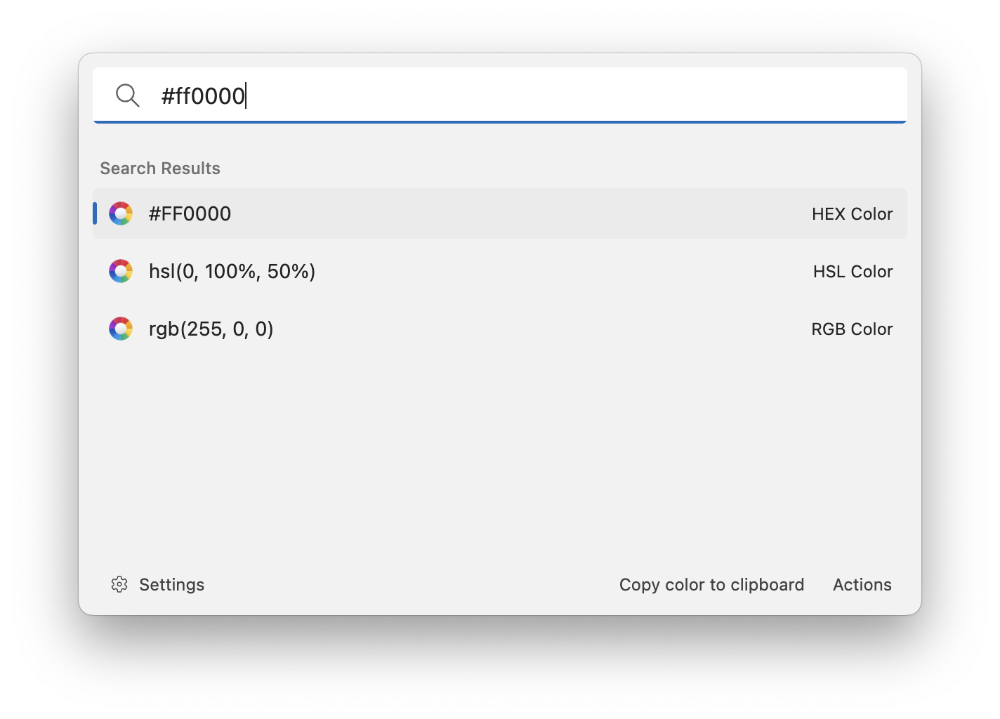

# Color Converter

This extension allows you to convert colors into different formats. Enter a color in HEX, HSL or RGB format and Ueli will show you the color in other formats. Press enter to copy the shown value to the clipboard.

## Settings

-   Color formats: the formats that you want to see in the search results.

## About this extension

Author: [Oliver Schwendener](https://github.com/oliverschwendener)

Supported operating systems:

-   Windows
-   macOS
-   Linux

Supported formats:

-   HEX
-   HSL
-   RGB(A)
