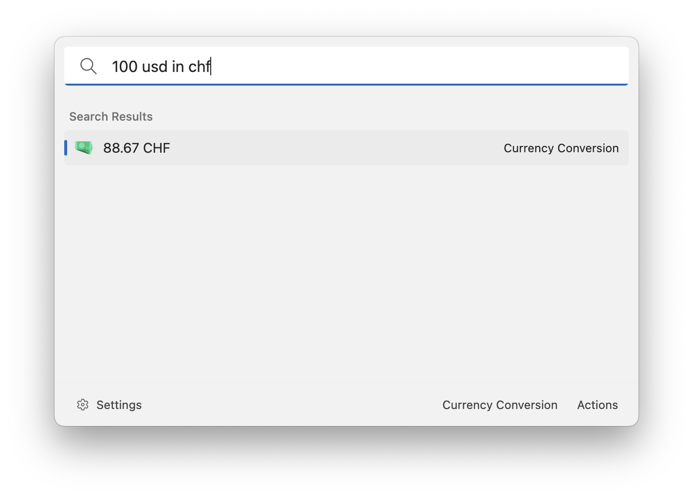

# Currency Conversion

This extension allows you to convert currencies with the current exchange rate. The exchange rates are provided by https://github.com/fawazahmed0/exchange-api.

Use this pattern to do the conversion: `{amount} {source currency} in|to {target currency}`. Press enter to copy the result into the clipboard.

For example:

-   `100 usd in chf`
-   `82 chf to usd`

## Settings

-   Currencies: the currencies that you want to convert from or to.

## About this extension

Author: [Oliver Schwendener](https://github.com/oliverschwendener)

Supported operating systems:

-   Windows
-   macOS
-   Linux
