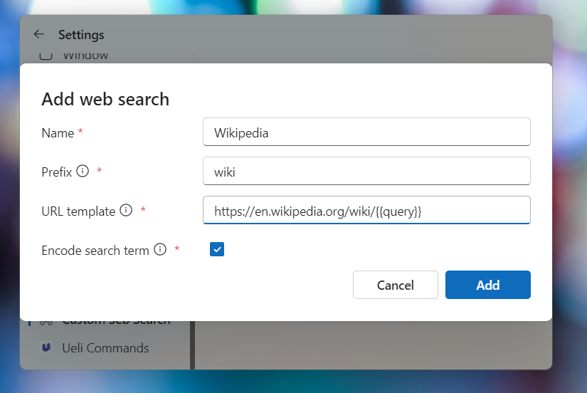

# Custom Web Search Extension

This extension allows define custom search engines, to directly search on the preferred website.

## Settings

-   **Name**: The name for your custom search engine (only visual).
-   **Prefix**: The prefix, which should trigger the custom search engine
-   **Url**: The URL, to which you want to be redirected. Use `{{query}}` placeholder, where the search term should be inserted
-   **Encode search term**: Specifies, if the search term should be URL encoded (e.g. `%20` for a space)

## About this extension

Author: [NiewView](https://github.com/NiewView)
Extension Icon: Designed by [OpenMoji](https://openmoji.org/) – the open-source emoji and icon project. License: [CC BY-SA 4.0](https://creativecommons.org/licenses/by-sa/4.0/#)

Supported operating systems:

-   Windows
-   macOS
-   Linux
