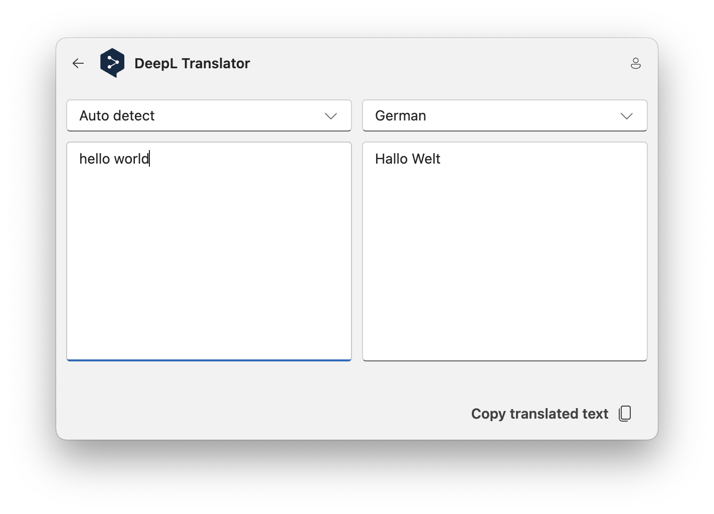

# DeepL Translator

This extension allows you to translate text into other languages using DeepL. Search for "DeepL Translator" and press enter. When opening this extension for the first time you have to enter your API key. After entering your API key you will see the DeepL translator view. Type in some text and the text will automatically be translated into the target language. You can copy the translated text to the clipboard by pressing "Copy translated text".

## DeepL Account

If you don't have a DeepL account, sign up on [DeepL's website](https://www.deepl.com/en/pro#developer) and create an API key [here](https://www.deepl.com/en/your-account/keys). You don't need to sign up for a paid plan, everything works with a free developer account.

## Settings

- API Key: the API key that you created on DeepL's website.
- Default source language: the source language that is selected by default.
- Default target language: the target language that is selected by default.

## About this extension

Author: [Oliver Schwendener](https://github.com/oliverschwendener)

Supported operating systems:

- Windows
- macOS
- Linux
