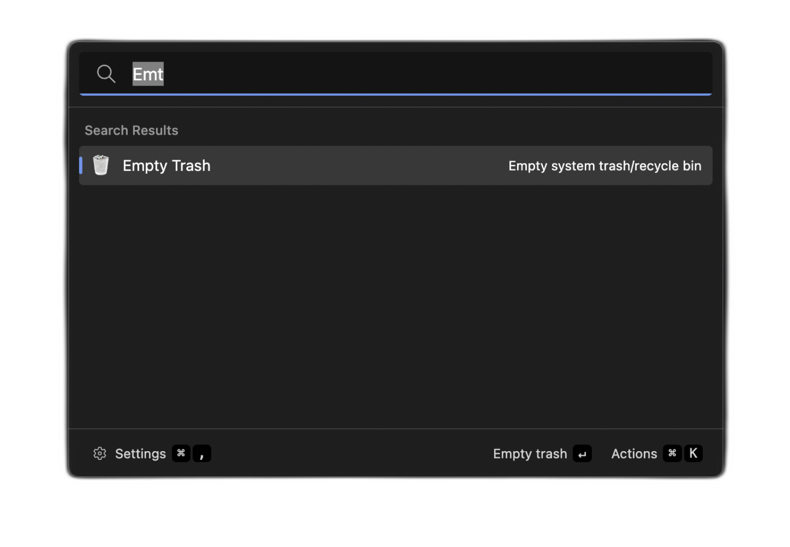

# Empty Trash Extension
This extension allows you to empty your system's trash/recycle bin directly from Ueli.

## About this extension
Author: [Ömer Duran](https://github.com/omerdduran)

Supported operating systems:
- Windows 
- macOS 
- Linux

> WARNING
> This action permanently deletes all files in your system's trash/recycle bin. This operation cannot be undone.