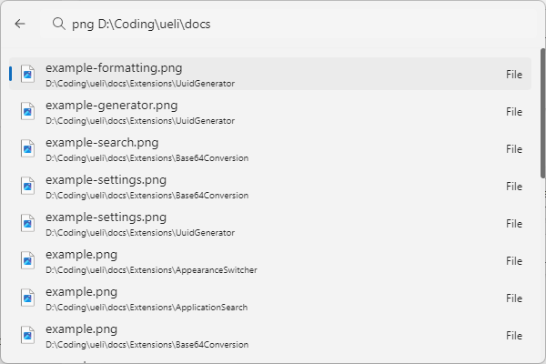

# File Search

This extension allows you to search for files and folders on your computer. Search for "Search files" and press enter to open the file search view. Enter a search term to find files and folders. Press enter to open the selected file.

The File Search extension uses `mdfind` (on macOS) and Everything (on Windows) under the hood to do the file search.

### Requirements

#### Windows

Make sure you have Everything and the Everything Command-line Interface installed from here: https://www.voidtools.com/.

#### macOS

On macOS you don't have to install any third-party tools. Just make sure the spotlight indexing service is up-and-running.

## Settings

- Max search result items: the maximum number of search result items that are shown. The lower this number the faster the search.
- (Windows) Everything CLI file path: the file path to the Everything Command-line Interface `es.exe`.

## About this extension

Author: [Oliver Schwendener](https://github.com/oliverschwendener)

Supported operating systems:

- Windows
- macOS
