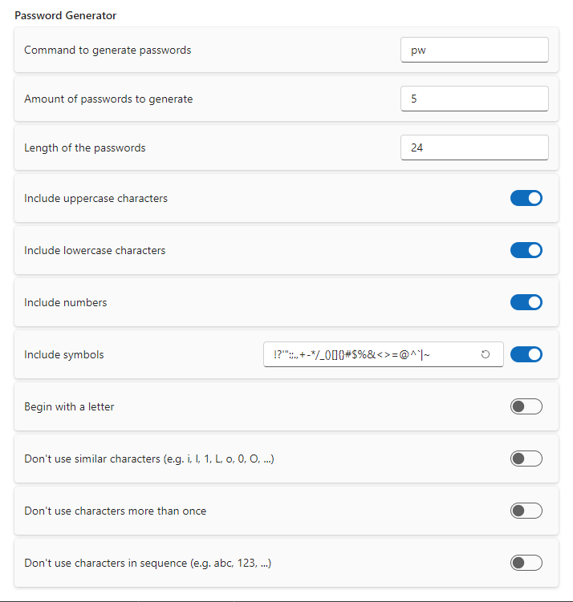

# Password Generator

This extension allows to generate secure passwords.

## Settings

- **Command to generate passwords**: The command in search window to start generating passwords
- **Amount of passwords to generate**: The amount of passwords generated as search results
- **Length of the passwords**: The length of the generated passwords
- **Include uppercase characters**: Whether the generated password can contain uppercase characters
- **Include lowercase characters**: Whether the generated password can contain lowercase characters
- **Include numbers**: Whether the generated password can contain numbers
- **Include symbols**: Whether the generated password can contain symbols
- **Symbols/Reset**: Add a set of symbols here or reset to the default ones
- **Begin with a letter**: Whether the generated password should start with a letter character
- **Don't use similar characters**: Whether the generated password should prohibit similar characters
- **Don't use duplicate characters**: Whether the generated password should consist of unique characters
- **Don't use characters in sequence**: Whether the generated password should prohibit characters in sequence

## About this extension

Author: [Marco Senn-Haag](https://github.com/MarcoSennHaag)

Supported operating systems:

- Windows
- macOS
- Linux
