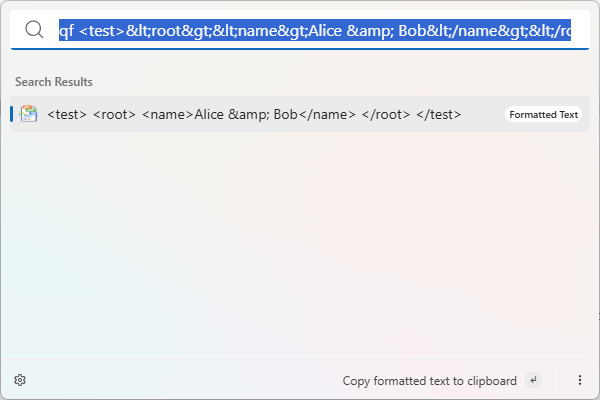
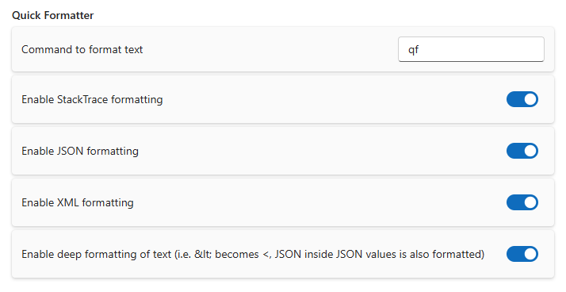

# Quick Formatter

This extension aims to help software developers to quickly format XML and JSON documents and also
helps to format log messages including stacktraces which may or may not contain XML or JSON documents.

## Settings

- **Command to format text**: The command in search window to start formatting text.
  You can append an 'st', 'j' or 'x' to limit to only one of the formats mentioned.
- **Enable StackTrace**: Whether to format text to StackTrace-like output
- **Enable JSON**: Whether to format text to JSON
- **Enable XML**: Whether to format text to XML
- **Enable Deep Formatting**: Whether to format text inside values (i.e. JSON inside XML, XML inside JSON, JSON inside JSON, XML inside XML, JSON or XML inside StackTraces, StackTraces inside JSON, ...). The resulting output may no longer be valid XML or JSON in this mode, but it is pretty printed for display and analysis.

## About this extension

Author: [Marco Senn-Haag](https://github.com/MarcoSennHaag)

Supported operating systems:

- Windows
- macOS
- Linux
