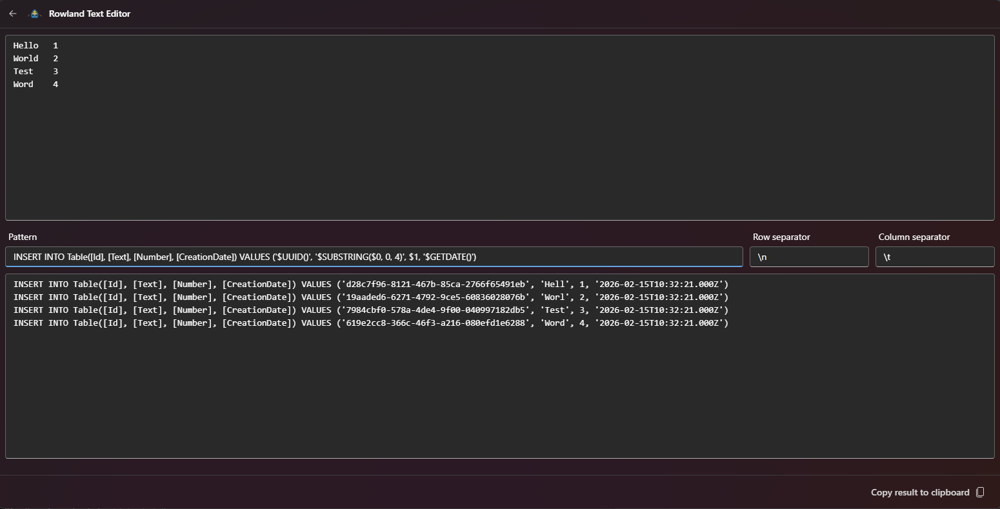

# Rowland Text Editor

Rowland is a simple row-based text editor that allows you to create and manipulate text content using built-in functions. It supports template functions that can be used to generate UUIDs, format dates, extract substrings, and more.

## Features

- Applying patterns foreach row in a given text
- Split rows into multiple in the pattern accessible substrings
- Multiple functions

## Examples



## Functions

### UUID(format, version)

Generate a UUID (Universally Unique Identifier) in Microsoft .NET GUID format.

**Parameters:**

- `format` (optional): Format character - `N`, `D`, `B` or `P`. Default: `D`
- `version` (optional): UUID version - `v4`, `v6`, or `v7`. Default: `v4`

**Format Options:**

- **N** - 32 digits without hyphens: `xxxxxxxxxxxxxxxxxxxxxxxxxxxxxxxx`
- **D** - 32 digits with hyphens (default): `xxxxxxxx-xxxx-xxxx-xxxx-xxxxxxxxxxxx`
- **B** - Braces format: `{xxxxxxxx-xxxx-xxxx-xxxx-xxxxxxxxxxxx}`
- **P** - Parentheses format: `(xxxxxxxx-xxxx-xxxx-xxxx-xxxxxxxxxxxx)`

**Examples:**

```JavaScript
UUID()          → 550e8400-e29b-41d4-a716-446655440000
UUID(N)         → 550e8400e29b41d4a716446655440000
UUID(B, v7)     → {550e8400-e29b-41d4-a716-446655440000}
UUID(P, v6)     → (550e8400-e29b-41d4-a716-446655440000)
```

### GETDATE(format)

Generate the current date and time in the specified format.

**Parameters:**

- `format` (optional): Date format string. Default: `yyyy-MM-ddTHH:mm:ss.000Z`

**Format Tokens:**

- `yyyy` - 4-digit year
- `MM` - 2-digit month (01-12)
- `dd` - 2-digit day (01-31)
- `HH` - 2-digit hour (00-23)
- `mm` - 2-digit minute (00-59)
- `ss` - 2-digit second (00-59)
- `SSS` - 3-digit milliseconds (000-999)

**Examples:**

```JavaScript
GETDATE()                   → 2026-02-15T14:30:45.123Z
GETDATE(yyyy-MM-dd)         → 2026-02-15
GETDATE(HH:mm:ss)           → 14:30:45
GETDATE(dd/MM/yyyy HH:mm)   → 15/02/2026 14:30
```

### SUBSTRING(string, start, length)

Extract a substring from the provided text.

**Parameters:**

- `string` (required): The input text
- `start` (required): Starting index (0-based)
- `length` (required): Number of characters to extract

**Examples:**

```JavaScript
SUBSTRING("Hello World", 0, 5)    → Hello
SUBSTRING("Hello World", 6, 5)    → World
SUBSTRING("Hello World", 0, 11)   → Hello World
```

## Error Handling

The extension will throw errors for:

- Invalid UUID format characters (must be single character: N, D, B, or P)
- Invalid or insufficient parameters for functions
- Non-numeric parameters where numbers are required
