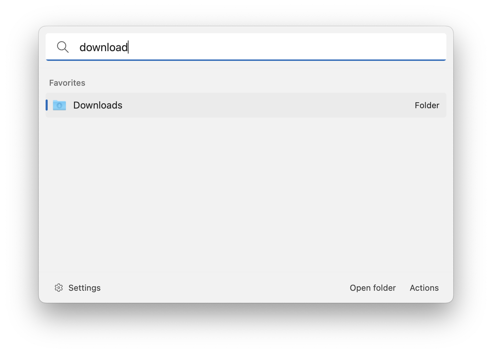

# Simple File Search

This extension allows you to search for files and folders in specific locations.

> Note that this extension is not made for scanning top-level folders, hence the term "simple".

## Settings

- Path: the path to the folder in which you want to search for files and folders
- Search for:
    - Files and folders: select this option if you want to search for files and folders
    - Files: select this option if you want to search for files only
    - Folders: select this option if you want to search for folders only
- Recursive: whether to do a recursive scan. Note that if you enable this option on a folder that contains a lot of files, you might experience poor performance or even brake the app.

## About this extension

Author: [Oliver Schwendener](https://github.com/oliverschwendener)

Supported operating systems:

- Windows
- macOS
- Linux
