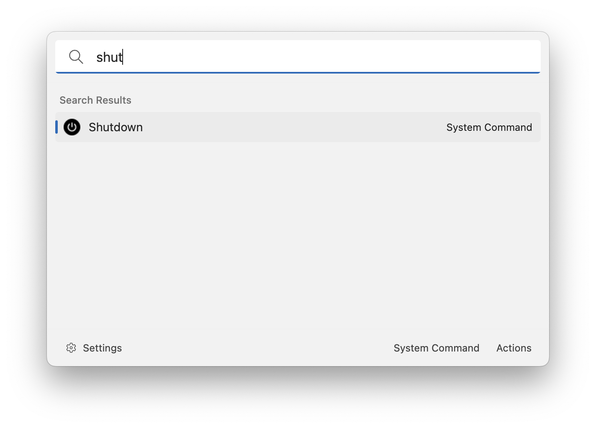

# System Commands

This extension allows you to search operating system commands. Press enter to invoke the system command.

## Supported system commands:

### Windows

-   Shutdown
-   Restart
-   Sign out
-   Lock
-   Sleep
-   Hibernate

### macOS

-   Shutdown
-   Restart
-   Log out
-   Sleep
-   Lock

## About this extension

Author: [Oliver Schwendener](https://github.com/oliverschwendener)

Supported operating systems:

-   Windows
-   macOS
