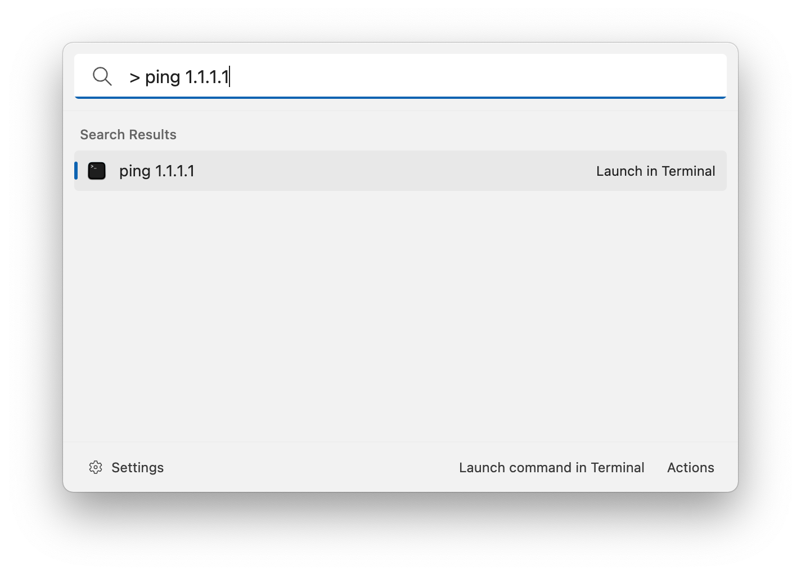

# Terminal Launcher

This extension allows you to launch terminals with a given command. Use this pattern: `{prefix} {command}` for example: `> ping 1.1.1.1` and press enter to launch the given terminal.

## Settings

-   Prefix: the prefix that triggers the terminal launcher.
-   Terminals: the list of terminals that will show up in the search result list.

## About this extension

Author: [Oliver Schwendener](https://github.com/oliverschwendener)

Supported operating systems:

-   Windows
-   macOS
