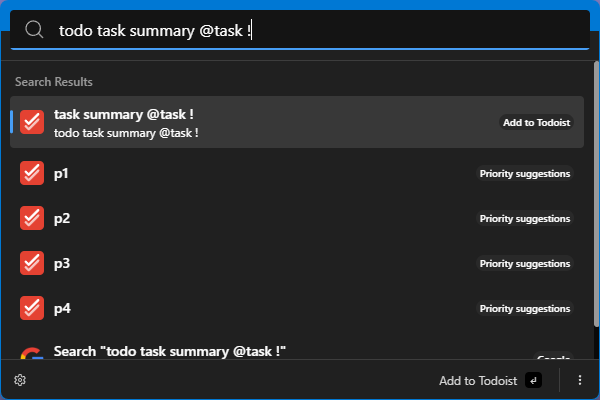

# Todoist Extension

This extension lets you add tasks to Todoist and browse your active tasks directly from Ueli's search field. It supports both the Quick Add endpoint and a task list mode so you can capture and open tasks without leaving the launcher.

## How it works

### Quick Add

- Type the configured quick-add prefix (default `todo`) followed by a space.
- Write the task text and use `@`, `#`, or `!` near the end of the input to trigger suggestions for labels, projects, or priorities.
- Pick a suggestion to replace the fragment with the proper token (priority tokens are `p1`–`p4` followed by a space).
- Press enter to run the Quick Add action; the raw text is forwarded to Todoist's `/rest/v2/quick/add` endpoint.
- Ueli posts a native OS notification indicating success or failure and then closes the search window.

### Task list

- Type the task-list prefix (default `tdl`) to fetch the latest active tasks from Todoist.
- Tasks are sorted by due date then creation date and can be filtered further by typing after the prefix (matches task content, project name, and label names case-insensitively).
- Selecting a task launches Todoist either in the browser or desktop app based on the configured target.
- If Todoist returns an error (including filter syntax errors) the list shows an inline error item instead of opening notifications.

## Settings

- Quick add prefix: case-insensitive trigger for Quick Add mode. Default `todo`.
- Task list prefix: case-insensitive trigger for the task list. Default `tdl`.
- Suggestion limit: maximum number of label/project suggestions and the page size for entity fetches. Default `15`.
- Task list limit: maximum number of tasks shown per refresh. Default `30`.
- Task open target: choose `browser` or `desktopApp` for the default open action.
- Task filter: optional Todoist filter query applied server-side when fetching tasks (uses Todoist's native syntax). Empty by default.
- API token: personal Todoist API token required for all operations. Stored via SafeStorage when marked sensitive.

## Requirements

- Todoist account with access to the REST API and Quick Add feature.
- API token from Todoist (Settings → Integrations → API token) saved in the extension settings before running Quick Add.

## Notifications and errors

- Quick Add success: native notification such as "Todoist: Task added".
- Quick Add failure: native notification summarizing the cause (missing token, Todoist API error, etc.).
- Task list errors: shown inline in the search results (for example filter syntax errors), keeping the previous cache when possible.

## About this extension

Author: [coucha](https://github.com/cou723)

Supported operating systems:

- Windows
- macOS
- Linux
