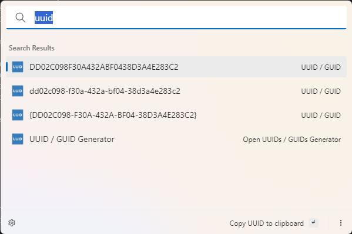
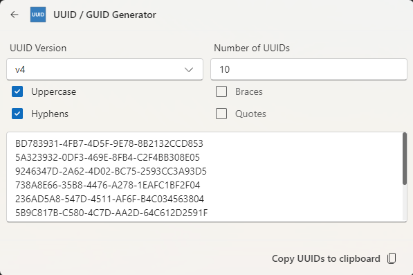
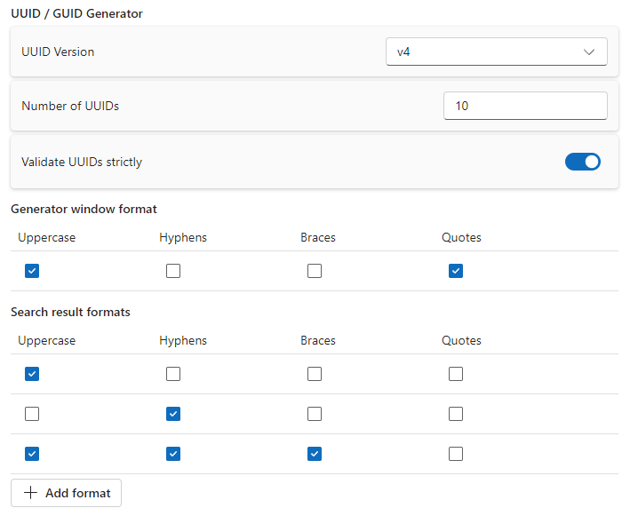

# UUID / GUID Generator

This extension allows to generate [Universally Unique Identifiers](https://en.wikipedia.org/wiki/Universally_unique_identifier), also known as UUID or GUID.
This can be done either instantly for a single UUID or through a dedicated UI, where multiple UUIDs can be generated at once.

This extension also allows to format the UUID to several different styles in a fast way.

## Settings

-   **UUID Version**: The UUID version, either [v4](<https://en.wikipedia.org/wiki/Universally_unique_identifier#Version_4_(random)>), [v6](<https://en.wikipedia.org/wiki/Universally_unique_identifier#Versions_1_and_6_(date-time_and_MAC_address)>) or [v7](<https://en.wikipedia.org/wiki/Universally_unique_identifier#Version_7_(timestamp_and_random)>)
-   **Number of UUIDs to generate**: The number of UUIDs that will be created, only applies when using the UI of the extension
-   **Uppercase**: Whether the characters of the UUID should be uppercase
-   **Hyphen**: Whether the UUID should contain hyphens (-)
-   **Braces**: Whether the UUID should be wrapped in braces ({})
-   **Quotes**: Whether the UUID should be wrapped in quotes
-   **Search result formats**: Several different formats for fast formatting in search results

## About this extension

Author: [Christopher Steiner](https://github.com/ChristopherSteiner)

Co-Author: [Marco Senn-Haag](https://github.com/MarcoSennHaag)

Supported operating systems:

-   Windows
-   macOS
-   Linux
