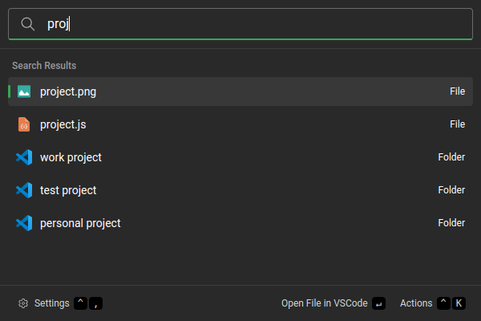

# VSCode Extension

This extension allows you to open recently edited projects and files in vscode.

## Settings

-   Prefix: the prefix that triggers the vscode extension.
-   Command: The command the the extension will invoke to open vscode and pass it the recent item.

## About this extension

Author: [Ethan Conneely](https://github.com/IrishBruse)

Supported operating systems:

-   Windows
-   macOS
-   Linux
