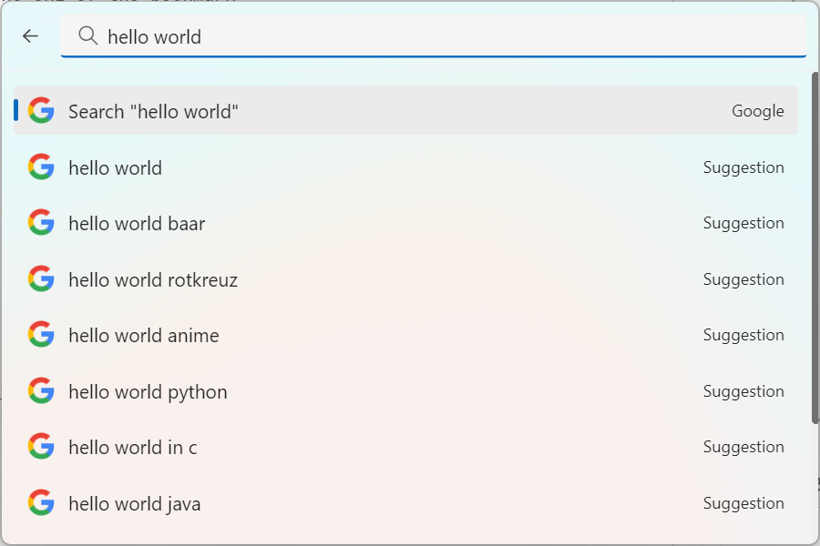

# Web Search

This extension allows you to search the web with Google or DuckDuckGo. Search for "Google" or "DuckDuckGo" and press enter to open the web search. Type in a search term, use the arrow keys to navigate up and down, and press "Enter" to open the search result in your browser.

## Settings

- Search Engine: the search engine to use.
- Locale: the location in which you want to search (currently only en-US, de-CH, ja-JP and ko-KR are supported).
- Show instant search result: wether to show a search result in the main search view for the current search term.

## About this extension

Author: [Oliver Schwendener](https://github.com/oliverschwendener)

Supported operating systems:

- Windows
- macOS
- Linux
