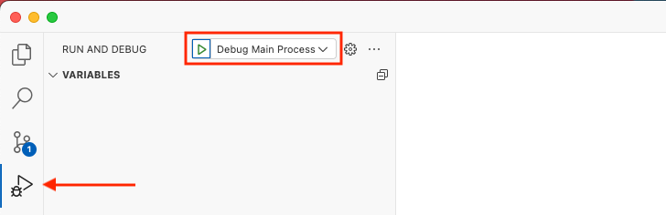

# Development

## Requirements

-   Node.js v22: https://nodejs.org/en
-   PNPM v9: https://pnpm.io/
-   Optional: if you're using Visual Studio Code we recomment to install the recommended extensions.

## Setup

-   Install dependencies

    ```
    $ pnpm install
    ```

## Running the app

-   Run app in dev mode

    ```
    $ pnpm dev
    ```

## Debugging

If you're using Visual Studio Code, you can start the debugger for the main process, see screenshot:


## Quality checks

-   Lint files

    ```
    $ pnpm lint
    ```

-   Perform typecheck

    ```
    $ pnpm typecheck
    ```

-   Run tests

    ```
    $ pnpm test
    ```

## Build and package the app

-   Build

    ```
    $ pnpm build
    ```

-   Package
    ```
    $ pnpm package
    ```
